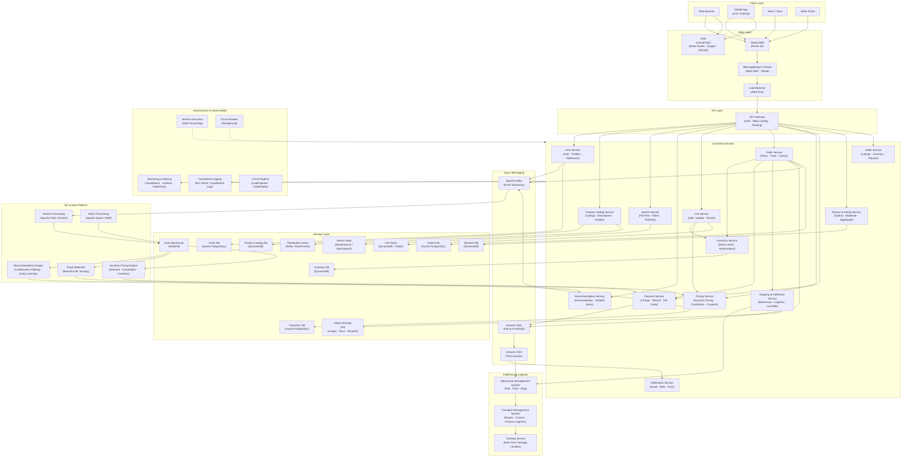

# Amazon — High Level System Design

---

## Overview

Amazon is the world's largest e-commerce platform serving 300M+ active customers across 20+ countries. It handles billions of product listings, millions of daily orders, real-time inventory management, dynamic pricing, warehouse fulfillment, and ML-driven personalization — all on a platform that must be available 24/7 with sub-second response times.

---

## System Design Diagram



---

## Component Breakdown

### Client Layer

| Client | Details |
|--------|---------|
| **Web Browser** | React SPA; server-side rendered product pages for SEO (Next.js style) |
| **Mobile App** | iOS / Android; supports offline cart, push notifications for deals |
| **Alexa / Voice** | Voice-driven shopping — reorders, cart additions, order status |
| **Seller Portal** | Dashboard for third-party sellers to manage listings, inventory, and payouts |

---

### Edge Layer

| Component | Role |
|-----------|------|
| **Route 53** | Latency-based global DNS routing users to the nearest AWS region |
| **CloudFront CDN** | Caches product images, static JS/CSS, and thumbnails at 400+ edge PoPs |
| **AWS WAF + Shield** | Blocks SQL injection, XSS, and DDoS attacks before they reach the origin |
| **ALB (Load Balancer)** | Distributes HTTP/2 traffic across auto-scaled service instances |

---

### Core Microservices

| Service | Responsibility |
|---------|---------------|
| **User Service** | Registration, login (OAuth/JWT), address book, payment methods |
| **Product Catalog** | Billions of listings — title, description, images, specs, seller info, categories |
| **Search Service** | Full-text search with filters (price, brand, rating), faceted navigation, autocomplete |
| **Recommendation Service** | "Customers also bought", "Inspired by your history", homepage personalization |
| **Cart Service** | Add/update/remove items, persist cart across devices, price recalculation |
| **Order Service** | Place order, split into sub-orders per seller/warehouse, track status, cancellations |
| **Inventory Service** | Real-time stock levels, soft reservations during checkout, restock alerts |
| **Pricing Service** | Base price + dynamic adjustments (demand, competition), coupon/promo application |
| **Payment Service** | Charge cards/wallets, split payments, refunds, fraud scoring gate |
| **Shipping & Fulfillment** | Routes orders to optimal warehouse, selects carrier, manages last-mile delivery |
| **Review & Rating** | Verified purchase reviews, star ratings, Q&A, moderation |
| **Notification Service** | Order confirmations, shipping updates, deal alerts via email/SMS/push |
| **Seller Service** | Seller onboarding, listing management, inventory sync, payout processing |

---

### Fulfillment & Logistics Pipeline

```
Order placed
  → Inventory Service reserves stock
    → Order routed to optimal fulfillment center (proximity + stock)
      → Warehouse Management System (WMS)
          → Pick: worker / robot locates item
          → Pack: items boxed, label printed
          → Ship: handed to carrier (UPS, FedEx, Amazon Logistics)
            → Transport Management System assigns route
              → Tracking Service publishes real-time location events
                → Notification Service pushes "Out for delivery" alert to customer
```

Amazon's **Kiva robots** (now Amazon Robotics) autonomously navigate warehouse floors, bringing shelves to human packers — reducing pick time by 75%.

---

### Async Messaging Architecture

Amazon uses a layered messaging approach:

| Layer | Technology | Purpose |
|-------|-----------|---------|
| **Fan-out** | Amazon SNS | One event → multiple downstream queues simultaneously |
| **Task queues** | Amazon SQS | Durable, at-least-once delivery for background jobs |
| **Event streaming** | Apache Kafka | High-throughput ordered event log for analytics and ML |

**Key event flows:**

| Event | Consumers |
|-------|-----------|
| `order.placed` | Inventory (reserve), WMS (fulfillment), Notification (confirmation) |
| `payment.succeeded` | Notification (receipt), Seller Service (payout trigger), Fraud audit |
| `payment.failed` | Notification (alert user), Order Service (rollback reservation) |
| `shipment.delivered` | Order Service (mark complete), Review Service (prompt review) |
| `product.viewed` | Kafka → Recommendation feedback loop |

---

### Storage Layer

| Store | Technology | Why |
|-------|-----------|-----|
| **Users DB** | Aurora PostgreSQL | Relational, ACID — user profiles, addresses, payment tokens |
| **Product Catalog** | DynamoDB | Billions of items, high read throughput, flexible schema per category |
| **Cart Store** | DynamoDB + Redis | DynamoDB for durability; Redis for sub-millisecond active session reads |
| **Orders DB** | Aurora PostgreSQL | ACID transactions — financial consistency across order lifecycle |
| **Inventory DB** | DynamoDB | High write throughput for real-time stock updates across warehouses |
| **Payments DB** | Aurora PostgreSQL | ACID compliance for financial records and audit trail |
| **Reviews DB** | DynamoDB | Semi-structured, high read volume, append-heavy write pattern |
| **Search Index** | OpenSearch (Elasticsearch) | Inverted index powering full-text search with facets and ranking |
| **Distributed Cache** | Redis (ElastiCache) | Product metadata, pricing, session tokens, homepage banners |
| **Object Storage** | AWS S3 | Product images, seller documents, invoices, ML training data |
| **Data Warehouse** | Amazon Redshift | Petabyte-scale OLAP for business intelligence and ML feature store |

---

### ML & Data Platform

| Component | Role |
|-----------|------|
| **Apache Flink / Kinesis** | Real-time stream processing — live clickstream, trending products, fraud signals |
| **Apache Spark / EMR** | Batch ETL — weekly model retraining, historical purchase analysis |
| **Recommendation Engine** | Collaborative filtering + deep learning; powers 35% of Amazon's revenue |
| **Fraud Detection** | Real-time ML scoring on every payment; blocks fraudulent orders in < 100ms |
| **Dynamic Pricing Engine** | Adjusts prices millions of times per day based on demand, inventory, and competitor prices |

---

### Key Design Decisions

#### 1. Inventory Reservation (Optimistic Locking)
When a customer adds an item to cart and begins checkout, a **soft reservation** is created in the Inventory Service with a TTL (e.g., 15 minutes). If checkout completes, the reservation converts to a confirmed deduction. If the TTL expires, stock is released. This prevents overselling without hard-locking inventory rows.

#### 2. Order Splitting
A single customer order may span multiple sellers and warehouses. The Order Service splits it into **sub-orders**, each routed independently through fulfillment. This allows partial shipments and isolated failure handling per seller.

#### 3. Search Ranking
Amazon's search ranking is not purely text-relevance — it is heavily influenced by:
- Purchase conversion rate
- Customer ratings and review count
- Sponsored placement (paid)
- Seller fulfillment performance (Prime eligibility)
- Personalization signals from the Recommendation Engine

#### 4. Database Per Service
Every microservice owns its data store — no shared databases. This enforces loose coupling and allows each service to choose the right database technology for its access pattern (DynamoDB for catalog, PostgreSQL for orders, Redis for cart).

#### 5. Flash Sale / Traffic Spike Handling
For events like Prime Day or Black Friday:
- Product pages and pricing are **pre-cached** in CloudFront and Redis hours before the sale
- Cart and Order Services are **auto-scaled** to 10× normal capacity in advance
- SQS queues absorb order bursts and process them at a controlled rate downstream
- Inventory uses **token bucket rate limiting** on reservation writes to prevent thundering-herd on hot items

---

## Data Flow — Purchase (Happy Path)

```
Customer searches "wireless headphones"
  → CDN serves cached search suggestions (autocomplete)
    → Search Service queries OpenSearch → ranked results returned
      → Customer clicks product → Product Catalog Service (cache hit in Redis)
        → Recommendation Service shows "Frequently bought together"
          → Add to Cart → Cart Service (DynamoDB) + Inventory soft reservation
            → Begin checkout → Pricing Service applies coupon
              → Payment Service → Fraud Detection ML score → Charge card
                → Order Service creates order → SNS fan-out
                  → SQS → WMS picks/packs/ships
                  → SQS → Notification Service → "Order confirmed" email
                    → Tracking Service updates in real time
                      → "Delivered" event → prompt customer review
```

---

## Scale Numbers (approximate)

| Metric | Value |
|--------|-------|
| Active Customers | 300 million+ |
| Products Listed | 350 million+ |
| Daily Orders | 10 million+ |
| Peak Orders/sec (Prime Day) | ~100,000+ |
| Price Changes/day | 2.5 million+ |
| Fulfillment Centers | 200+ worldwide |
| AWS Regions Serving Traffic | Multi-region active-active |
| Search Queries/day | Billions |
| ML-driven Revenue Share | ~35% (recommendations) |
| Uptime SLA | 99.99% |
