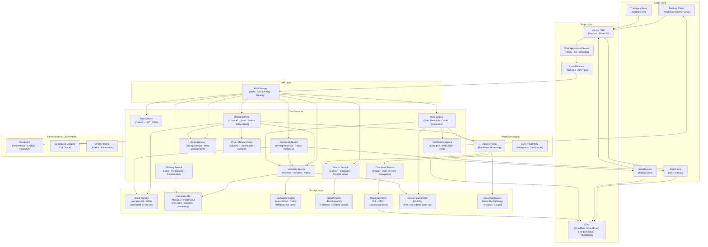

# Dropbox — High Level System Design

---

## Overview

Dropbox is a cloud file storage and synchronization platform serving 700M+ registered users across 180+ countries. It allows users to store files, sync them across all devices in real time, share with collaborators, and access them offline. The core engineering challenge is delivering **fast, conflict-free sync** across devices while handling petabytes of storage efficiently — ensuring a file saved on a laptop appears on a phone in seconds.

**Core operations:**
- **Upload:** Client detects file change → chunks file → uploads delta to cloud
- **Download / Sync:** Server detects change → pushes notification → client downloads delta
- **Share:** Generate share link or invite collaborators with permission control
- **Conflict Resolution:** Merge concurrent edits or create conflict copy

---

## System Design Diagram



---

## Component Breakdown

### Client Layer

| Client | Details |
|--------|---------|
| **Desktop Client** | Background daemon watches filesystem for changes; syncs delta chunks; maintains local cache for offline access |
| **Mobile App** | On-demand download (no full local copy by default); camera roll backup; offline favorites |
| **Web Browser** | Full file manager UI; upload/download/share/preview without installing software |
| **Third-party Apps** | Dropbox API consumers (e.g., Slack, Zoom, Canva) using OAuth2 tokens |

---

### Edge Layer

| Component | Role |
|-----------|------|
| **Global DNS** | Anycast routing directs users to nearest data center; failover between regions |
| **CDN** | Serves file downloads, thumbnails, and static assets from edge; eliminates origin load for popular files |
| **Load Balancer** | Distributes upload/download/API traffic across service instances; supports chunked transfer encoding |
| **WAF** | Rate limits API abuse, blocks malicious uploads, DDoS protection |

---

### Core Services

| Service | Responsibility |
|---------|---------------|
| **Auth Service** | OAuth2 login, JWT issuance, SSO (SAML for enterprise), API key management, session revocation |
| **Metadata Service** | Manages the virtual file tree: file paths, folder hierarchy, ownership, version history, timestamps |
| **Sync Engine** | Detects file deltas on the server side; resolves conflicts; generates change events per user namespace |
| **Upload Service** | Splits files into chunks, deduplicates via content hash, stores to S3, triggers downstream events |
| **Download Service** | Generates presigned S3 URLs or streams chunks; supports HTTP range requests for resume |
| **Sharing Service** | Creates shared links (public/password-protected/expiring), manages collaborator permissions (view/edit/comment) |
| **Notification Service** | Pushes file change events to connected clients via WebSocket / long-poll / mobile push (APNs/FCM) |
| **Thumbnail Service** | Generates image/video previews asynchronously from Kafka events; stores in S3 behind CDN |
| **Search Service** | Full-text and filename search over a user's file namespace; indexes content for documents (PDF, Docx) |
| **Quota Service** | Tracks per-user storage consumption in real time; enforces plan limits; handles referral bonuses |
| **Virus / Malware Scan** | Scans every uploaded file before it becomes accessible; quarantines infected files |

---

### File Chunking & Deduplication

Chunking is the foundation of Dropbox's efficiency — it powers fast sync, deduplication, and resumable uploads.

```
Original file (100 MB)
  → Split into 4 MB chunks (variable-size chunking for better dedup)
    → SHA-256 hash each chunk
      → Check block store: does this hash already exist?
          YES → skip upload (content-addressed dedup — same chunk shared globally)
          NO  → upload chunk to S3 with hash as key
            → Record chunk list in Metadata DB: [hash1, hash2, ..., hashN]
```

**Content-Addressed Storage:**
```
S3 key = SHA-256(chunk_bytes)
```
- Two users uploading the same file → only one copy stored in S3
- Editing a 1 GB file and changing one paragraph → only the changed chunks are re-uploaded
- Dropbox reported saving **petabytes** of storage through global deduplication

**Variable-Size Chunking (Rabin Fingerprinting):**
Fixed-size chunking fails when bytes are inserted at the start of a file (all chunk boundaries shift). Rabin fingerprinting computes a rolling hash to find natural chunk boundaries, so insertions only invalidate nearby chunks.

---

### Sync Protocol

The sync engine is the core of Dropbox's product — it must be fast, correct, and handle concurrent edits.

```
Client-side (file watcher daemon):
  1. OS filesystem event triggers (inotify / FSEvents / ReadDirectoryChangesW)
  2. Compute SHA-256 of changed file regions
  3. Compare with last-known chunk list in local DB
  4. Upload only changed chunks
  5. PATCH /metadata with new chunk list + version vector

Server-side (Sync Engine):
  1. Write new version to Metadata DB (version increment)
  2. Append delta to Change Journal (ordered log per user namespace)
  3. Notify all connected devices via Notification Service
  4. Each device fetches delta → downloads only missing chunks
```

**Conflict Resolution:**
```
Two devices edit the same file concurrently:
  → Device A uploads version 5 → server accepts
  → Device B uploads version 5 (based on version 4)
    → Server detects version vector conflict
      → Server keeps Device A's version as canonical
      → Creates "filename (Device B's conflicted copy 2026-04-25).ext"
      → Both versions preserved — no data loss
```

---

### Notification Architecture (Real-Time Sync)

```
Server writes file change to Change Journal
  → Sync Engine publishes event to Kafka topic: user.{user_id}.changes
    → Notification Service consumes event
      → Desktop clients: long-poll / WebSocket connection receives delta
      → Mobile clients: APNs (iOS) / FCM (Android) push notification
      → Web clients: Server-Sent Events (SSE) or WebSocket
        → Client fetches changed metadata → downloads missing chunks
```

**Long-Poll vs WebSocket:**
- Desktop clients maintain persistent long-poll connections (simpler, works through proxies)
- Web client uses WebSocket for bidirectional real-time updates
- Mobile uses push notifications to wake the app; app then polls for full delta

---

### Storage Layer

| Store | Technology | Why |
|-------|-----------|-----|
| **Block Storage** | Amazon S3 / GCS | Virtually unlimited, durable (11 nines), content-addressed by SHA-256 hash |
| **Metadata DB** | MySQL (sharded) | Relational file tree; strong consistency for ownership, paths, version history |
| **Distributed Cache** | Memcached / Redis | Caches file metadata, user quota, permission checks — eliminates DB round trips |
| **Change Journal DB** | MySQL | Ordered per-user delta log; clients poll cursor position to fetch only new changes |
| **Search Index** | Elasticsearch | Inverted index over filenames and document content; scoped to user namespace |
| **Thumbnail Store** | S3 + CDN | Pre-generated previews served at edge; keyed by file hash + dimensions |
| **Data Warehouse** | Redshift / BigQuery | Usage analytics, sync performance metrics, churn signals |

---

### Async Messaging Architecture

| Layer | Technology | Purpose |
|-------|-----------|---------|
| **Event streaming** | Apache Kafka | File events fan out to thumbnail generation, search indexing, analytics |
| **Background jobs** | SQS / RabbitMQ | Virus scans, thumbnail retries, quota recalculation, expiry cleanup |

**Key event flows:**

| Event | Producer | Consumers |
|-------|----------|-----------|
| `file.uploaded` | Upload Service | Virus Scanner, Thumbnail Service, Search Indexer, Quota Service, Kafka→DW |
| `file.changed` | Sync Engine | Notification Service (push to devices), Change Journal, Search re-index |
| `file.deleted` | Metadata Service | Quota Service (free storage), Search (remove from index), Thumbnail cleanup |
| `share.created` | Sharing Service | Notification (email invite), Audit log |

---

### Key Design Decisions

#### 1. Content-Addressed Block Store (Global Deduplication)
Every chunk is stored once, globally, keyed by its SHA-256 hash. Two users uploading the same file share the same S3 objects. This is why Dropbox can store petabytes efficiently — popular files (OS installers, common PDFs) exist as a single copy regardless of how many users have them.

#### 2. Delta Sync (Only Changed Chunks)
Rather than re-uploading entire files on every change, the client computes which chunks changed and uploads only those. A 1 GB video with a renamed title tag might upload just one 4 MB chunk. This makes sync fast even on slow connections.

#### 3. Change Journal as Source of Truth for Sync State
Each user namespace has an append-only Change Journal — an ordered log of deltas with a monotonically increasing cursor. Clients track their last-seen cursor position. On reconnect after any outage, a client simply fetches all journal entries after its cursor — no full reconciliation scan needed.

#### 4. Metadata Sharding Strategy
The Metadata DB is sharded by `user_id` (namespace sharding). All file tree operations for a user hit the same shard, enabling efficient range scans within a user's folder hierarchy. Cross-user operations (shared folders) use a secondary ownership table with pointers into each user's shard.

#### 5. Shared Folder Consistency
When a file in a shared folder is changed, all members must see the update atomically. Dropbox uses a **shared namespace** model: shared folders have their own namespace ID; all members' file trees reference this namespace by ID rather than copying data. The Change Journal for the shared namespace fans out events to all member notification channels.

#### 6. Offline-First Client Design
Desktop clients maintain a local SQLite database mirroring the server-side metadata for their synced folders. When offline, file operations are queued locally. On reconnect, the client replays queued operations against the server, applying conflict resolution if concurrent server changes occurred.

---

## Data Flow — File Upload (Happy Path)

```
User saves document.pdf (50 MB) on laptop
  → Desktop file watcher detects inotify event
    → Client splits file into 4 MB chunks (13 chunks)
      → SHA-256 each chunk → check local DB for known hashes
        → 10 chunks already on server (dedup) → skip
        → 3 new/changed chunks → upload to Upload Service
          → Upload Service: virus scan each chunk
            → Store chunks in S3 (key = SHA-256 hash)
              → PATCH Metadata Service: new chunk list + increment version
                → Metadata DB updated → Change Journal entry appended
                  → Kafka: file.changed event published
                    → Notification Service pushes delta to user's phone & tablet
                      → Phone downloads 3 new chunks → file up to date in ~seconds
```

---

## Data Flow — File Download / Sync (Happy Path)

```
User's phone receives push notification: "document.pdf changed"
  → Mobile app wakes → GET /changes?cursor=<last_cursor>
    → Change Journal returns delta: [chunk3_hash, chunk7_hash, chunk11_hash changed]
      → Mobile checks local cache: chunk3 already cached → skip
        → Download Service: GET /block/{chunk7_hash}
          → CDN HIT → chunk returned from edge (< 20ms)
          → CDN MISS → S3 fetch → cached at CDN → returned to client
            → Reassemble chunks → write updated file to device storage
```

---

## Scale Numbers (approximate)

| Metric | Value |
|--------|-------|
| Registered Users | 700 million+ |
| Daily Active Users | 17 million+ (paid) |
| Files Stored | 500 billion+ |
| Data Stored | Exabytes |
| Files Uploaded / day | 1.2 billion+ |
| Peak Upload Throughput | Hundreds of Gbps |
| Chunk size | 4 MB (variable via Rabin fingerprinting) |
| Deduplication savings | ~50–70% of raw storage |
| Sync latency (LAN) | < 5 seconds |
| Metadata DB shards | Hundreds (sharded by user namespace) |
| S3 durability | 99.999999999% (11 nines) |
| CDN PoPs | 200+ worldwide |
| Uptime SLA | 99.9% |
