# Instagram — High Level System Design

---

## Overview

Instagram is a photo and video sharing social platform with 2B+ monthly active users uploading 100M+ photos and videos daily. It serves a highly personalized home feed, 24-hour ephemeral Stories, short-form Reels, an Explore discovery page, and Direct Messaging — all backed by ML-driven content ranking, real-time engagement, and global media delivery at massive scale.

---

## System Design Diagram

```mermaid
flowchart TD
    subgraph Clients["Client Layer"]
        IOS["iOS App"]
        AND["Android App"]
        WEB["Web Browser"]
    end

    subgraph Edge["Edge Layer"]
        DNS["Global DNS\n(Anycast)"]
        CDN["CDN\n(Facebook Edge Network)\n(Photos · Videos · Reels · Stories)"]
        LB["Load Balancer\n(L7 — HTTP/2)"]
        WAF["WAF & DDoS Protection\n(Cloudflare / Custom)"]
    end

    subgraph Gateway["API Layer"]
        AG["API Gateway\n(Auth · Rate Limiting · Routing)"]
        WS["WebSocket Server\n(DMs · Notifications · Live)"]
    end

    subgraph Core["Core Microservices"]
        US["User Service\n(Auth · Profiles · Follow Graph)"]
        PS["Post Service\n(Create · Delete · Carousel · Tags)"]
        FS["Feed Service\n(Home Feed Generation & Ranking)"]
        STORY["Story Service\n(24hr Ephemeral · Highlights)"]
        REELS["Reels Service\n(Short-form Video · Discover)"]
        EXP["Explore Service\n(Discovery · Trending · Search)"]
        CS["Comment Service\n(Post · Thread · Replies)"]
        LS["Like & Engagement Service\n(Likes · Saves · Shares)"]
        DM["Direct Message Service\n(1:1 · Group · Threads)"]
        NS["Notification Service\n(Push · In-App · Email)"]
        RS["Recommendation Service\n(Accounts · Content · Hashtags)"]
        ADS["Ad Service\n(Targeting · Auction · Delivery)"]
        MOD["Content Moderation Service\n(Policy · Hate Speech · CSAM)"]
    end

    subgraph MediaPipeline["Media Processing Pipeline"]
        UPLOAD["Chunked Upload\n(Resumable — photos · videos)"]
        COMPRESS["Compression & Resizing\n(Multi-resolution thumbnails)"]
        VTRANS["Video Transcoding\n(H.264 · H.265 · VP9 · multiple bitrates)"]
        MSTORE["Media Store\n(Encrypted Blob — Facebook CDN Origin)"]
    end

    subgraph FeedPipeline["Feed Generation Pipeline"]
        FANOUT["Fanout Service\n(Write-time fan-out for regular users)"]
        FEEDCACHE["Feed Cache\n(Pre-computed feed — Redis per user)"]
        PULLRANK["Pull & Rank\n(On-read for celebrities / high-follower)"]
        RANK["Feed Ranking Engine\n(ML — interest · recency · engagement)"]
    end

    subgraph Messaging["Async Messaging"]
        KAFKA["Apache Kafka\n(Event Streaming)"]
    end

    subgraph Storage["Storage Layer"]
        USERDB["Users & Follow Graph\n(TAO — Facebook Graph DB)"]
        POSTDB["Posts & Media Metadata\n(Cassandra)"]
        FEEDDB["Feed Store\n(Redis — pre-computed timelines)"]
        CMTDB["Comments DB\n(Cassandra)"]
        ENGDB["Engagement Counters\n(Cassandra / Redis)"]
        STORYDB["Stories Store\n(Cassandra + Redis TTL)"]
        DMDB["DM Store\n(Cassandra — encrypted)"]
        CACHE["Distributed Cache\n(Memcached / Redis)"]
        S3["Media Blob Store\n(Facebook Haystack / f4)"]
        DW["Data Warehouse\n(Hive / Presto / Spark)"]
        ESEARCH["Search Index\n(Elasticsearch)"]
    end

    subgraph ML["ML & Data Platform"]
        STREAM["Stream Processing\n(Apache Flink)"]
        BATCH["Batch Processing\n(Apache Spark)"]
        FEEDML["Feed Ranking Model\n(Interest · Relationship · Timeliness)"]
        REELML["Reels Ranking Model\n(Watch-through · Reshares · Completion)"]
        EXPLOREML["Explore Ranking Model\n(Novelty · Engagement · Safety)"]
        CONTENTMOD["Moderation ML\n(Vision · NLP classifiers)"]
        ADML["Ad Relevance Model\n(CTR · Conversion prediction)"]
    end

    subgraph Infra["Infrastructure & Observability"]
        SD["Service Mesh\n(Envoy / Istio)"]
        MON["Monitoring\n(Prometheus · Grafana · ODS)"]
        LOG["Centralized Logging\n(Scuba / ELK)"]
        CB["Circuit Breaker\n(Resilience4j)"]
    end

    %% Clients → Edge
    IOS & AND & WEB --> DNS
    DNS --> WAF --> LB
    IOS & AND & WEB --> CDN

    %% Edge → Gateway
    LB --> AG
    LB --> WS

    %% Gateway → Services
    AG --> US
    AG --> PS
    AG --> FS
    AG --> STORY
    AG --> REELS
    AG --> EXP
    AG --> CS
    AG --> LS
    AG --> DM
    AG --> RS
    AG --> ADS

    %% WebSocket
    WS <--> DM
    WS <--> NS

    %% Media upload flow
    PS --> UPLOAD --> COMPRESS
    COMPRESS --> VTRANS --> MSTORE --> S3
    MSTORE --> CDN

    %% Feed pipeline
    PS --> FANOUT
    FANOUT --> FEEDCACHE
    FS --> FEEDCACHE
    FS --> PULLRANK
    FEEDCACHE --> RANK
    PULLRANK --> RANK
    RANK --> FEEDML

    %% Stories TTL
    STORY --> STORYDB

    %% Kafka events
    PS --> KAFKA
    LS --> KAFKA
    US --> KAFKA
    KAFKA --> STREAM
    KAFKA --> NS
    KAFKA --> MOD

    %% Service → Storage
    US --> USERDB
    PS --> POSTDB
    PS --> CACHE
    CS --> CMTDB
    LS --> ENGDB
    DM --> DMDB
    EXP --> ESEARCH
    ADS --> DW

    %% ML pipeline
    STREAM --> DW
    BATCH --> DW
    DW --> FEEDML --> RANK
    DW --> REELML --> REELS
    DW --> EXPLOREML --> EXP
    DW --> CONTENTMOD --> MOD
    DW --> ADML --> ADS

    %% Observability
    Core --> MON
    Core --> LOG
    SD & CB -.-> Core
```



---

## Component Breakdown

### Client Layer

| Client | Details |
|--------|---------|
| **iOS App** | Native Swift app; camera-first design; supports AR filters, Stories, Reels, Live |
| **Android App** | Native Kotlin app; adaptive image quality based on network conditions |
| **Web Browser** | React SPA; full feature parity for feed, Reels, Stories, DMs, Explore |

---

### Edge Layer

| Component | Role |
|-----------|------|
| **Anycast DNS** | Routes users to the nearest Facebook data center |
| **Facebook Edge Network** | Proprietary CDN — serves photos, videos, Reels, Stories from 100+ edge PoPs |
| **L7 Load Balancer** | Routes HTTP/2 traffic; sticky sessions for WebSocket DM connections |
| **WAF + DDoS Protection** | Filters malicious traffic before reaching origin services |

---

### Core Microservices

| Service | Responsibility |
|---------|---------------|
| **User Service** | Sign-up/login (OAuth), follow/unfollow, block, profile bio, verified badges |
| **Post Service** | Create/delete posts, carousel uploads, location tags, user mentions, hashtags |
| **Feed Service** | Assembles the personalized home feed using pre-computed + ranked candidates |
| **Story Service** | 24-hour ephemeral content; Story Highlights (permanent curated stories) |
| **Reels Service** | Short-form video feed (≤90s); separate ranking optimized for completion rate |
| **Explore Service** | Discovery page — accounts, hashtags, trending Reels, topic clusters |
| **Comment Service** | Threaded comments, replies, emoji reactions, pinned comments |
| **Like & Engagement** | Like/unlike, saves to collections, shares, story views |
| **Direct Message** | 1:1 and group encrypted DMs; supports media, voice messages, polls |
| **Notification Service** | Like/comment/follow/mention alerts via push (FCM/APNs), in-app, email |
| **Recommendation Service** | Suggested accounts, related hashtags, similar content signals |
| **Ad Service** | Auction-based ad delivery in feed, Stories, Reels, Explore |
| **Content Moderation** | Automated and human review for policy violations — hate speech, nudity, spam |

---

### Media Processing Pipeline

```
User selects photo or video
  → Client applies filters / edits locally
    → Chunked resumable upload to Post Service
      → Compression & Resizing:
          Photos → multiple resolutions: 150px (thumb) · 320px · 640px · 1080px
          Videos → multiple bitrates for adaptive streaming
        → Video Transcoding Farm:
            Codecs: H.264 (compat) · H.265 (efficiency) · VP9
            Resolutions: 480p · 720p · 1080p · 4K (for Reels)
          → Encrypted blobs stored in Facebook Haystack / f4 object store
            → Pushed to CDN edge PoPs
              → Post metadata (media URLs, dimensions, filters) written to Cassandra
                → Kafka event triggers Feed Fanout pipeline
```

**Facebook Haystack** is a custom object store optimized for small file random reads — ideal for billions of photo thumbnail lookups. **f4** is a warm/cold tier for less-accessed content.

---

### Feed Generation — Hybrid Fanout Architecture

Instagram solves the **celebrity problem** (Kylie Jenner has 400M followers — fanning out her post to 400M feed caches is prohibitively expensive) with a hybrid model:

#### Fanout on Write (Regular Users — < ~1M followers)
```
User posts photo
  → Fanout Service reads follower list from TAO graph
    → Writes post ID into each follower's Feed Cache (Redis) in parallel
      → When follower opens app → Feed already pre-computed, instant response
```

#### Pull + Rank on Read (Celebrities / High-follower accounts)
```
User opens feed
  → Feed Service detects followed celebrities
    → Pulls recent posts from celebrity Post DB on demand (not pre-fanned-out)
      → Merges with pre-computed feed entries
        → Feed Ranking Engine orders all candidates
```

#### Feed Ranking — ML Signals
The ranking model scores each candidate post on three axes:

| Signal Category | Examples |
|----------------|---------|
| **Interest** | Past likes, saves, watch time for similar content/creators |
| **Relationship** | Mutual follows, DM history, post tags, profile visits |
| **Timeliness** | Post recency, user's last app open time |
| **Content type** | User preference for photos vs Reels vs carousels |

---

### Stories — Ephemeral Design

Stories require automatic deletion after 24 hours:

```
Story uploaded → stored in Cassandra with a 24-hour TTL
  → Redis caches active story list per user (TTL-synced)
    → Viewers fetched from CDN (pre-positioned on upload)
      → Story view event → Kafka → counter incremented in Cassandra
        → On TTL expiry → story removed from Cassandra + CDN purged
          → User can save to Highlights → archived separately (no expiry)
```

---

### Reels — Separate Ranking Pipeline

Reels has a distinct ranking model from the home feed because its optimization target is different:

| Feed Ranking Goal | Reels Ranking Goal |
|------------------|--------------------|
| Meaningful engagement with followed accounts | Maximum watch-through and resharing from all content |
| Favors accounts you follow | Favors content quality regardless of follow |
| Recency matters a lot | Viral potential matters more than recency |

Reels ranking features: **video completion rate, reshare rate, audio/hashtag trends, creator reputation**.

---

### Direct Messaging

Instagram DMs use a **WebSocket persistent connection** for real-time delivery:

```
Sender sends DM
  → Encrypted and sent via WebSocket to DM Service
    → Stored in Cassandra (E2EE for optional secret conversations)
      → If recipient online → delivered via WebSocket
        → If recipient offline → FCM/APNs push notification
          → Read receipts returned via WebSocket
```

Group DMs fan out to all members. Instagram threads (formerly Messenger integration) supports polls, collaborative posts, and shared Reels in DMs.

---

### Async Messaging — Kafka

| Event | Consumers |
|-------|-----------|
| `post.created` | Fanout Service, Search indexer, Moderation ML |
| `post.liked` | Engagement counter, Notification Service, Feed ranking signal |
| `user.followed` | Fanout Service (add to follower's feed), Notification Service |
| `story.viewed` | View counter (Cassandra), Creator analytics |
| `reel.completed` | Reels ranking model feedback, Creator analytics |
| `comment.posted` | Notification (creator + mentioned users), Moderation queue |

---

### Storage Layer

| Store | Technology | Why |
|-------|-----------|-----|
| **Users & Social Graph** | TAO (Facebook's graph DB) | Purpose-built for social graph — fast edge traversal for follower/following lists |
| **Posts & Media Metadata** | Cassandra | Wide-column, linearly scalable, high write throughput for billions of posts |
| **Feed Store** | Redis | Pre-computed timeline lists; O(1) sorted set operations per feed read |
| **Comments** | Cassandra | Append-heavy, high read volume, flexible schema for threads |
| **Engagement Counters** | Cassandra + Redis | Cassandra for durability; Redis for real-time in-memory counter increments |
| **Stories** | Cassandra + Redis TTL | Automatic expiry maps naturally to TTL-based storage |
| **DM Store** | Cassandra | Ordered by timestamp, high write/read throughput, per-conversation partition key |
| **Search Index** | Elasticsearch | Inverted index for account/hashtag/location full-text search |
| **Media Blob Store** | Facebook Haystack / f4 | Custom object store optimized for billions of small file random-read lookups |
| **Data Warehouse** | Hive / Presto / Spark | Petabyte-scale OLAP — ad analytics, ML feature computation, creator insights |

---

### ML & Data Platform

| Component | Role |
|-----------|------|
| **Apache Flink** | Real-time stream processing — live engagement signals, trending detection |
| **Apache Spark** | Batch ML feature engineering — weekly model retraining from full interaction history |
| **Feed Ranking Model** | Deep neural network scoring home feed candidates on interest, relationship, timeliness |
| **Reels Ranking Model** | Optimizes for completion rate and reshare rate; powers 70%+ of Reels consumption |
| **Explore Ranking Model** | Balances novelty, quality, and safety for non-followed content discovery |
| **Moderation ML** | Computer vision (nudity, graphic violence) + NLP (hate speech, harassment) classifiers |
| **Ad Relevance Model** | CTR and conversion prediction for personalized ad delivery |

---

### Key Design Decisions

#### 1. TAO — Social Graph at Scale
Instagram (via Meta) uses **TAO (The Associations and Objects)** — a distributed graph database purpose-built for social networks. It stores objects (users, posts) and associations (follows, likes) with a read-heavy cache layer. TAO makes follower list lookups for feed fanout extremely fast.

#### 2. Cassandra for Posts — No Single Point of Failure
Post and comment data lives in **Cassandra** — a masterless, linearly scalable wide-column store. Data is partitioned by `user_id` with a clustering key of `post_timestamp`, making all posts for a user a single sequential read. Adding nodes increases throughput with zero downtime.

#### 3. The N+1 Follower Problem (Celebrity Fanout)
Writing a Beyoncé post to 300M follower feeds would take too long synchronously. Instagram's hybrid model avoids this:
- Pre-fanout for normal users (write-time, fast reads)
- Pull-on-read for celebrities (no fanout cost, merged at read time)
- The threshold is dynamically adjusted based on follower count

#### 4. Stories Expiry Without Cron Jobs
Rather than running batch deletion jobs, stories use **Cassandra TTL** — a native per-row expiry. When the TTL fires, Cassandra automatically tombstones the record. Redis also mirrors the TTL for active story cache invalidation.

#### 5. Engagement Counter Accuracy
Like counts are stored in **Redis** for real-time increment speed (millions of likes per second during viral moments), then asynchronously flushed to Cassandra for durability. Displayed counts may lag by a few seconds but are eventually consistent.

---

## Data Flow — Post Upload & Feed Delivery (Happy Path)

```
User takes photo and posts
  → Media uploaded in chunks to Post Service
    → Compression + CDN distribution (multiple resolutions)
      → Post metadata written to Cassandra
        → Kafka event: post.created
          → Fanout Service writes post_id to followers' Redis feed caches
            → Moderation ML scans image asynchronously

Follower opens Instagram
  → Feed Service reads pre-ranked post_ids from Redis (instant)
    → Fetches post metadata batch from Cassandra (or cache)
      → Feed Ranking Engine re-scores and reorders
        → Returns personalized feed with media URLs pointing to CDN
          → Client loads images/videos from nearest CDN edge PoP
            → User likes post → Like Service → Redis counter++
              → Kafka event → Notification Service → push to post owner
```

---

## Scale Numbers (approximate)

| Metric | Value |
|--------|-------|
| Monthly Active Users | 2 billion+ |
| Daily Active Users | 500 million+ |
| Photos / Videos Uploaded / Day | 100 million+ |
| Stories Posted / Day | 500 million+ |
| Likes Per Day | 4.2 billion+ |
| Reels Plays / Day | 200 billion+ |
| Explore Page Monthly Users | 200 million+ |
| CDN Edge PoPs | 100+ globally |
| Feed Ranking Candidates Scored | Hundreds per feed request |
| Ad Revenue / Year | $50 billion+ |
| Engineers | ~10,000 (Meta Instagram team) |
