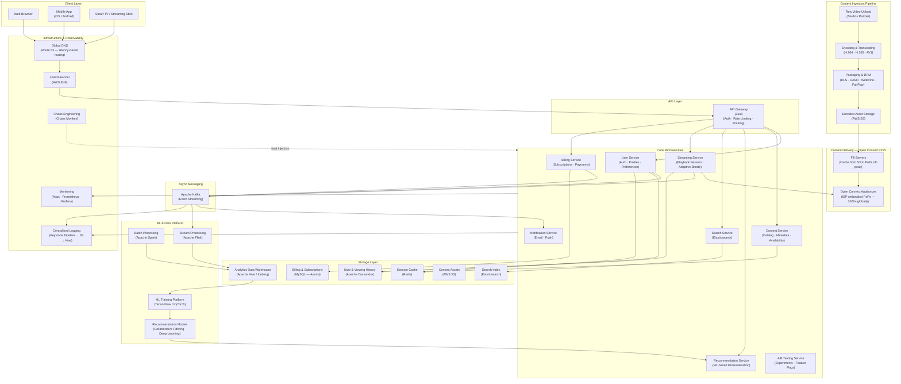

# Netflix — High Level System Design

---

## Overview

Netflix is the world's largest video streaming platform with 260M+ subscribers across 190 countries. It serves billions of hours of video per month, requiring an ultra-reliable, low-latency global delivery system built on adaptive bitrate streaming, a massive CDN, and ML-driven personalization.

---

## System Design Diagram



---

## Component Breakdown

### Client Layer

| Client | Details |
|--------|---------|
| **Web Browser** | React-based SPA; adaptive video via HTML5 MSE |
| **Mobile App** | iOS / Android; supports offline download via DRM-protected local storage |
| **Smart TV / Stick** | Roku, Fire TV, Apple TV, Samsung — device-specific SDKs |

---

### API Layer — Zuul Gateway

Netflix's **Zuul** (API Gateway) is the front door for all API traffic:
- JWT-based authentication and session validation
- Per-user and per-device rate limiting
- Dynamic routing to the correct microservice
- Request/response filtering and transformation
- Integrated with **Hystrix** for circuit breaking

---

### Core Microservices

| Service | Responsibility |
|---------|---------------|
| **User Service** | Registration, login, multi-profile management, preferences |
| **Content Service** | Catalog of titles, metadata (genres, cast, synopsis), regional availability |
| **Recommendation Service** | Personalised homepage rows using ML models; "Because you watched…", "Top picks" |
| **Search Service** | Full-text search with autocomplete, backed by Elasticsearch |
| **Streaming Service** | Issues playback manifests (HLS/DASH), tracks playback position, manages bitrate ladders |
| **Billing Service** | Subscription lifecycle, payment processing, invoicing |
| **Notification Service** | New title alerts, payment receipts, account security emails |
| **A/B Testing Service** | Routes users into experiments; controls feature flags for UI and algorithm variants |

---

### Content Ingestion Pipeline

```
Studio delivers raw video (4K HDR, multiple audio tracks)
  → Encoding Farm transcodes into 8+ resolution/bitrate rungs
      (240p → 1080p → 4K) × (H.264, H.265, AV1)
    → Packaging applies DRM encryption
        (Widevine for Android/Chrome, FairPlay for Apple, PlayReady for Windows)
      → Encoded chunks stored in AWS S3
        → Replicated to Open Connect PoPs globally (off-peak fill)
```

Netflix encodes each title into **~1,200 file variants** to support every device, network condition, and codec.

---

### Open Connect CDN

Netflix's proprietary CDN — the most critical scalability component:

- **Open Connect Appliances (OCAs)** are physical servers placed directly inside ISP networks at 1,000+ locations worldwide.
- During off-peak hours, popular content is **pre-positioned** (filled) from S3 into local OCAs.
- At playback time, the Streaming Service resolves the nearest healthy OCA for the user's ISP — delivering video from a server potentially < 1 ms away.
- This offloads ~95% of Netflix's traffic from the public internet onto ISP last-mile links.

| Without CDN | With Open Connect |
|------------|-----------------|
| All traffic hits AWS origin | ~95% served from ISP-local OCAs |
| High latency globally | Sub-10ms video segment delivery |
| Expensive egress costs | Lower bandwidth cost via peering |

---

### Async Messaging — Kafka

| Event | Consumers |
|-------|-----------|
| `playback.started` | Analytics (Flink), Recommendation feedback loop |
| `playback.paused` / `resumed` | Viewing history (Cassandra resume point) |
| `playback.completed` | Recommendation model training signal, Notification Service |
| `payment.succeeded` | Notification Service (receipt), Billing audit log |
| `user.registered` | Notification Service (welcome email), Recommendation (cold start) |

---

### Storage Layer

| Store | Technology | Why |
|-------|-----------|-----|
| **User & Viewing History** | Apache Cassandra | Linearly scalable, multi-region, high write throughput; resume position updated on every heartbeat |
| **Billing & Subscriptions** | MySQL (AWS Aurora) | ACID compliance required for financial records |
| **Session Cache** | Redis | Sub-millisecond token validation, catalog metadata caching |
| **Search Index** | Elasticsearch | Inverted index for full-text title/cast search |
| **Content Assets** | AWS S3 | Durable object store for encoded video chunks, images, subtitles |
| **Analytics Warehouse** | Apache Hive / Iceberg | Petabyte-scale offline analytics, ML training datasets |

---

### ML & Data Platform

| Component | Role |
|-----------|------|
| **Apache Flink** | Real-time stream processing — calculates trending titles, live A/B metrics |
| **Apache Spark** | Batch ETL — computes weekly recommendation model training features |
| **ML Training Platform** | Trains collaborative filtering and deep learning recommendation models |
| **Recommendation Models** | Powers personalized homepage rows, search ranking, thumbnail selection |

Netflix's recommendation system accounts for **~80% of content watched** — making this the highest-ROI part of the platform.

---

### Chaos Engineering — Chaos Monkey

Netflix intentionally kills random production instances to validate that the system self-heals:
- **Chaos Monkey** — terminates random EC2 instances
- **Latency Monkey** — injects artificial network delays
- **Chaos Kong** — simulates entire AWS region failure

This enforces that every service is built resilient by default.

---

## Key Design Decisions

### 1. Adaptive Bitrate Streaming (ABR)
The client player dynamically switches between quality levels based on measured network bandwidth. Netflix uses **DASH** and **HLS** manifests with segment durations of 2–4 seconds. If bandwidth drops, the player seamlessly downgrades to a lower bitrate segment — no buffering.

### 2. Microservices at Scale
Netflix pioneered the migration from monolith to microservices (~2008–2012). Each service:
- Owns its data store (no shared databases)
- Deploys independently via Spinnaker CI/CD
- Is protected by Hystrix circuit breakers

### 3. Multi-Region Active-Active
Netflix runs in multiple AWS regions simultaneously. Using **Cassandra's** multi-region replication and **Route 53** latency-based DNS, users are always routed to the nearest healthy region. A full region failure triggers automatic failover.

### 4. Personalized Thumbnails
The A/B Testing Service and Recommendation Service collaborate to serve **different artwork for the same title** to different users. A user who watches action films sees an action-heavy thumbnail; a user who watches romances sees a different crop — all optimized to maximize click-through.

### 5. Data Pipeline for Recommendations
```
Viewing events → Kafka → Flink (real-time features)
                       → Hive (historical features)
                           → Spark ML training jobs
                               → Model registry
                                   → Recommendation Service (serving)
```
Models are retrained weekly (offline) and updated in real time with short-term signals.

---

## Data Flow — Video Playback (Happy Path)

```
User clicks Play
  → API Gateway (validate JWT session)
    → Streaming Service (create playback session)
      → Resolve nearest Open Connect OCA for user's ISP
        → Return HLS/DASH manifest URL to client player
          → Client fetches first segment from OCA (< 10ms on same ISP)
            → ABR player measures bandwidth → selects quality rung
              → Playback heartbeat every 30s → updates resume position in Cassandra
                → On completion → Kafka event → Recommendation feedback loop
```

---

## Scale Numbers (approximate)

| Metric | Value |
|--------|-------|
| Subscribers | 260 million+ |
| Countries | 190 |
| Hours streamed / day | 200 million+ |
| Open Connect PoPs | 1,000+ globally |
| Title variants per encode | ~1,200 files |
| Peak internet traffic share | ~15% of global downstream |
| Kafka events / day | Trillions |
| Cassandra nodes | Thousands (multi-region) |
| A/B tests running concurrently | Hundreds |
