# Notification System — High Level System Design

---

## Overview

A Notification System is a platform-agnostic service responsible for reliably delivering messages to users across multiple channels — push notifications (iOS/Android), email, SMS, and in-app alerts. It is a foundational backend component used by virtually every major product (social media, e-commerce, banking, SaaS). The core engineering challenges are **reliable at-least-once delivery**, **multi-channel fan-out**, **user preference enforcement**, and **high throughput** — a single product event (e.g., a flash sale) can trigger tens of millions of notifications in seconds.

**Core operations:**
- **Trigger:** Upstream service publishes an event → notification pipeline picks it up
- **Route:** Determine which users to notify, via which channels, with what content
- **Deliver:** Send via APNs (iOS), FCM (Android), SMTP (email), SMS gateway (Twilio/SNS)
- **Track:** Record delivery status, open rates, click-through, failures, and retries

---

## System Design Diagram

```mermaid
flowchart TD
    subgraph Producers["Event Producers (Upstream Services)"]
        SVC_A["Order Service"]
        SVC_B["Social / Feed Service"]
        SVC_C["Marketing / Campaign Service"]
        SVC_D["Auth / Security Service"]
        SVC_E["Billing Service"]
    end

    subgraph Gateway["Notification API Layer"]
        API["Notification API\n(REST / gRPC)\n(Auth · Validation · Rate Limit)"]
    end

    subgraph Core["Core Notification Services"]
        INGEST["Ingest Service\n(Event normalization · Schema validation)"]
        PREF["Preference Service\n(User opt-ins · Channel · Quiet hours)"]
        TEMPLATE["Template Service\n(Handlebars / Jinja2 · i18n · Personalization)"]
        ROUTER["Routing Service\n(Channel selection · Audience resolution · Priority)"]
        DEDUP["Dedup & Rate Limit Service\n(Idempotency · Frequency capping)"]
        SCHEDULER["Scheduler Service\n(Delay · Timezone-aware · Campaign batching)"]
        TRACKER["Tracking & Analytics Service\n(Delivery · Open · Click · Bounce)"]
        RETRY["Retry & DLQ Manager\n(Exponential backoff · Dead letter queue)"]
    end

    subgraph Messaging["Async Messaging Layer"]
        KAFKA["Apache Kafka\n(Per-channel topics · Priority lanes)"]
        DLQ["Dead Letter Queue\n(Kafka / SQS DLQ)"]
    end

    subgraph Workers["Channel Delivery Workers"]
        PUSH_W["Push Worker\n(APNs · FCM · Web Push)"]
        EMAIL_W["Email Worker\n(SMTP · SendGrid · SES)"]
        SMS_W["SMS Worker\n(Twilio · SNS · Vonage)"]
        INAPP_W["In-App Worker\n(WebSocket / SSE · Redis Pub/Sub)"]
        WEBHOOK_W["Webhook Worker\n(Third-party callbacks)"]
    end

    subgraph Providers["External Delivery Providers"]
        APNS["APNs\n(Apple Push Notification Service)"]
        FCM["FCM\n(Firebase Cloud Messaging)"]
        WEBPUSH["Web Push\n(VAPID Protocol)"]
        SENDGRID["SendGrid / AWS SES\n(Email delivery)"]
        TWILIO["Twilio / AWS SNS\n(SMS delivery)"]
    end

    subgraph Storage["Storage Layer"]
        PREF_DB["Preference DB\n(MySQL / PostgreSQL)\n(User opt-ins · channel settings)"]
        TEMPLATE_DB["Template Store\n(MySQL + S3)\n(Templates · versions · i18n)"]
        NOTIF_DB["Notification Log DB\n(Cassandra / DynamoDB)\n(Delivery history · status)"]
        CACHE["Cache\n(Redis)\n(Preferences · device tokens · dedup keys)"]
        TOKEN_DB["Device Token Store\n(DynamoDB)\n(user_id → [device tokens])"]
        ANALYTICS_DB["Analytics Store\n(ClickHouse / BigQuery)\n(Delivery · engagement metrics)"]
    end

    subgraph Infra["Infrastructure & Observability"]
        MON["Monitoring\n(Prometheus · Grafana · PagerDuty)"]
        LOG["Centralized Logging\n(ELK Stack)"]
        ALERT["Alerting\n(Delivery rate · failure rate · latency)"]
    end

    %% Producers → API / Kafka
    SVC_A & SVC_B & SVC_C & SVC_D & SVC_E --> API
    SVC_A & SVC_B --> KAFKA

    %% API → Ingest
    API --> INGEST

    %% Ingest pipeline
    INGEST --> PREF
    INGEST --> DEDUP
    PREF --> PREF_DB
    PREF --> CACHE

    %% Routing & templating
    DEDUP --> ROUTER
    ROUTER --> TEMPLATE
    ROUTER --> SCHEDULER
    TEMPLATE --> TEMPLATE_DB

    %% Scheduler → Kafka channel topics
    SCHEDULER --> KAFKA

    %% Kafka → Workers
    KAFKA --> PUSH_W
    KAFKA --> EMAIL_W
    KAFKA --> SMS_W
    KAFKA --> INAPP_W
    KAFKA --> WEBHOOK_W

    %% Workers → Providers
    PUSH_W --> APNS
    PUSH_W --> FCM
    PUSH_W --> WEBPUSH
    EMAIL_W --> SENDGRID
    SMS_W --> TWILIO

    %% Delivery callbacks → Tracker
    APNS & FCM & SENDGRID & TWILIO --> TRACKER
    TRACKER --> NOTIF_DB
    TRACKER --> ANALYTICS_DB

    %% Retry & DLQ
    PUSH_W & EMAIL_W & SMS_W --> RETRY
    RETRY --> DLQ
    RETRY --> KAFKA

    %% Token store
    PUSH_W --> TOKEN_DB

    %% In-app delivery
    INAPP_W --> CACHE

    %% Observability
    Core --> MON
    Workers --> MON
    MON --> ALERT
    Core --> LOG
```



---

## Component Breakdown

### Event Producers

Any upstream service can trigger a notification by publishing an event. Two integration patterns are supported:

| Pattern | How | Used For |
|---------|-----|---------|
| **Synchronous API call** | `POST /notifications/send` via REST or gRPC | Transactional alerts (OTP, password reset, order confirmed) — caller needs confirmation |
| **Async event publish** | Publish to Kafka topic `notification.events` | Product events (new follower, like, comment) — fire-and-forget, high volume |

---

### Core Services

| Service | Responsibility |
|---------|---------------|
| **Ingest Service** | Validates incoming events against schema, normalizes format, enriches with user context |
| **Preference Service** | Resolves user's channel opt-ins, notification type preferences, quiet hours, and do-not-disturb windows |
| **Template Service** | Renders notification content using templates (Handlebars/Jinja2); supports i18n (50+ languages), personalization tokens |
| **Routing Service** | Decides which channels to use for each user based on preferences, device availability, and notification priority |
| **Dedup & Rate Limit** | Prevents duplicate notifications (idempotency key check); enforces per-user frequency caps (e.g., max 3 push/hour) |
| **Scheduler Service** | Handles delayed sends, timezone-aware delivery (send at 9am local time), campaign batch scheduling |
| **Tracking Service** | Records delivery receipts, open events, click-through callbacks; updates notification status in DB |
| **Retry & DLQ Manager** | Exponential backoff on provider failures; routes permanently failed notifications to Dead Letter Queue for analysis |

---

### Notification Priority Lanes

Not all notifications are equal. The system uses separate Kafka topics and worker pools per priority tier to prevent low-priority campaigns from blocking critical alerts.

| Priority | Examples | Latency Target | Kafka Topic |
|----------|---------|---------------|-------------|
| **P0 — Critical** | OTP, fraud alert, password reset, 2FA | < 2 seconds | `notif.critical` |
| **P1 — Transactional** | Order confirmed, payment received, flight update | < 10 seconds | `notif.transactional` |
| **P2 — Engagement** | New follower, comment, like, mention | < 30 seconds | `notif.engagement` |
| **P3 — Marketing** | Flash sale, newsletter, re-engagement campaign | Minutes–Hours | `notif.marketing` |

Each priority lane has dedicated Kafka partitions and isolated delivery worker pools — a marketing campaign surge does not exhaust resources needed for OTP delivery.

---

### Preference & Opt-out Enforcement

Before any notification is dispatched, the Preference Service resolves the user's current settings:

```
Incoming notification for user_id=123, type=NEW_FOLLOWER
  → Preference Service checks (Redis cache first, DB fallback):
      - Is user opted into NEW_FOLLOWER notifications? → YES
      - Preferred channels for NEW_FOLLOWER: [push, in-app] (not email)
      - Quiet hours: 22:00–08:00 user local time → currently 03:00 → DEFER
          → Scheduler: enqueue delivery at 08:00 user local time
      - Frequency cap: user received 2 push notifications in last hour → cap=3 → ALLOW
  → Route to [push, in-app] channels only
```

**Preference hierarchy (most specific wins):**
```
Global opt-out (unsubscribe all)
  > Category opt-out (e.g., marketing off)
    > Notification type opt-out (e.g., like notifications off)
      > Channel opt-out (e.g., SMS off)
        > Default settings
```

---

### Template & Personalization Engine

```
Template: "Hi {{first_name}}, {{sender_name}} liked your post: \"{{post_preview}}\""

Context: {
  first_name: "Sirisha",
  sender_name: "Alice",
  post_preview: "System design is fascinating..."
}

Rendered (EN): "Hi Sirisha, Alice liked your post: \"System design is fascinating...\""
Rendered (ES): "Hola Sirisha, a Alice le gustó tu publicación: \"El diseño de sistemas es fascinante...\""
```

Templates are versioned and stored in MySQL (metadata) + S3 (full content). The Template Service supports:
- **A/B testing**: serve template variant A to 50% of users, variant B to 50%
- **Rich content**: HTML email templates, push notification images, action buttons
- **Fallback chain**: if personalization data is missing, fall back to generic copy

---

### Channel Delivery Workers

#### Push Notification Worker (APNs / FCM)

```
Kafka consumer reads push notification job
  → Fetch device tokens from Token Store (DynamoDB): user_id → [token1, token2, ...]
    → User has 3 devices (phone, tablet, second phone)
      → Send to all active tokens via APNs / FCM HTTP/2 API
        → APNs response:
            200 OK             → mark delivered
            410 Gone           → token invalid → delete from Token Store
            429 Too Many Reqs  → back off → retry with exponential delay
            503 Unavailable    → retry → escalate to DLQ after N attempts
```

**APNs vs FCM:**
| Provider | Platform | Protocol | Token Validity |
|----------|---------|---------|---------------|
| APNs | iOS, macOS, watchOS | HTTP/2 + JWT | Until user uninstalls app |
| FCM | Android, Web | HTTP/2 | Until app unregisters |
| Web Push | Chrome, Firefox, Edge | VAPID / RFC 8030 | Until user revokes |

#### Email Worker

```
Kafka consumer reads email job
  → Template Service renders HTML + plain-text fallback
    → SendGrid / AWS SES API call
      → SendGrid webhooks deliver callbacks:
          delivered   → Tracker: mark delivered
          opened      → Tracker: record open event (pixel tracking)
          clicked     → Tracker: record click-through
          bounced     → Tracker: mark bounced → suppress future sends
          spam report → Preference Service: unsubscribe user from marketing
```

#### SMS Worker

```
Kafka consumer reads SMS job
  → Select provider by region (Twilio for US/EU, SNS for fallback, Vonage for APAC)
    → Twilio API call: POST /Messages
      → Delivery receipt webhook:
          delivered  → Tracker: mark delivered
          failed     → Retry → fallback to alternate provider → DLQ
          undelivered → Suppress — invalid number
```

**Provider fallback chain:**
```
Primary: Twilio
  → Failure / timeout → Failover: AWS SNS
    → Failure → Failover: Vonage
      → All failed → DLQ → alert on-call
```

#### In-App Notification Worker

```
Kafka consumer reads in-app job
  → User online? (check Redis presence key)
      YES → push via WebSocket / Server-Sent Events to connected client
      NO  → store in Redis list: inapp:user_id → append notification
              → Client fetches on next app open: GET /notifications/unread
```

---

### Deduplication & Idempotency

Distributed systems guarantee at-least-once delivery — the same event can be processed multiple times. Without dedup, a user receives the same "Order confirmed" push five times.

```
Every notification job carries an idempotency_key:
  idempotency_key = SHA-256(event_type + user_id + source_event_id)

Before processing:
  → Redis SET NX idempotency_key EX 86400  (24-hour TTL)
      SET returned OK  → first time seen → process normally
      SET returned NIL → duplicate → skip silently
```

**Frequency capping (rate limiting per user):**
```
Redis sorted set: ratelimit:push:{user_id}
  → ZADD current_timestamp → ZREMRANGEBYSCORE (remove entries older than window)
  → ZCARD → if count >= cap → defer or drop notification
```

| Channel | Default Cap |
|---------|------------|
| Push | 5 per hour, 20 per day |
| Email | 3 per day (transactional exempt) |
| SMS | 2 per day (critical exempt) |
| In-app | No cap |

---

### Retry Strategy & Dead Letter Queue

```
Delivery attempt fails (provider error / timeout)
  → Retry Worker: exponential backoff schedule
      Attempt 1: immediate
      Attempt 2: +30 seconds
      Attempt 3: +2 minutes
      Attempt 4: +10 minutes
      Attempt 5: +1 hour
  → After 5 failures → move to Dead Letter Queue (DLQ)
    → Alert on-call if DLQ depth exceeds threshold
    → Operations team can inspect, fix, and replay DLQ messages
```

**Permanent failures (no retry):**
- Invalid device token (APNs 410) → delete token, no retry
- Hard email bounce (user doesn't exist) → suppress address permanently
- User unsubscribed → drop immediately, no retry

---

### Storage Layer

| Store | Technology | Why |
|-------|-----------|-----|
| **Preference DB** | MySQL / PostgreSQL | Relational; user opt-ins, channel settings, quiet hours — strong consistency required |
| **Template Store** | MySQL (metadata) + S3 (content) | Templates are read-heavy; S3 for large HTML bodies; MySQL for version metadata |
| **Notification Log** | Cassandra / DynamoDB | Append-heavy; write at scale; query by `(user_id, timestamp)` for inbox and history |
| **Device Token Store** | DynamoDB | Key-value: `user_id → [device_token, platform, created_at]`; fast multi-device lookup |
| **Cache** | Redis | Preferences (TTL 5min), device tokens (TTL 1hr), dedup keys, presence flags, in-app queues |
| **Analytics Store** | ClickHouse / BigQuery | Column-oriented OLAP; delivery rates, open rates, click-through by campaign, channel, cohort |

---

### Key Design Decisions

#### 1. Per-Priority Kafka Topics with Dedicated Worker Pools
A single Kafka topic with mixed priorities means a marketing campaign burst delays OTP delivery. Separate topics with dedicated consumer groups and independent auto-scaling policies ensures P0 critical notifications are never starved by P3 marketing volume.

#### 2. Token Hygiene (Stale Token Cleanup)
Device tokens become invalid when users uninstall the app. Sending to a stale token wastes resources and pollutes metrics. Every `410 Gone` response from APNs or equivalent from FCM triggers an immediate token deletion from DynamoDB. Periodic batch jobs scan for tokens older than 90 days with no successful delivery and archive them.

#### 3. Timezone-Aware Scheduling
Marketing notifications sent at 3am local time have far lower open rates and generate unsubscribes. The Scheduler Service stores the user's timezone (resolved from device or profile) and delays delivery until a configurable "polite window" (default: 09:00–21:00 local). Delayed jobs are stored in a Redis sorted set scored by delivery timestamp and consumed by a polling Scheduler worker.

#### 4. Multi-Provider SMS Routing
SMS delivery rates vary significantly by carrier and country. A single provider dependency is a single point of failure. The SMS Worker uses a provider selection strategy:
- **Geography-based primary:** cheapest + highest delivery rate provider per country
- **Automatic failover:** if primary returns error or timeout → next provider in chain
- **Circuit breaker:** if provider failure rate > 10% in 60s → open circuit → skip to next provider

#### 5. Notification Inbox (Pull Model for In-App)
Push delivery is unreliable (app killed, phone offline, token expired). The system also maintains a server-side **notification inbox** per user in Cassandra. When a user opens the app, they always fetch their unread inbox regardless of whether push was delivered. This guarantees eventual delivery without depending on push infrastructure.

#### 6. Observability-Driven Delivery
Every notification tracks its full lifecycle state machine:

```
CREATED → ROUTED → SCHEDULED → DISPATCHED → DELIVERED → OPENED → CLICKED
                                          ↘ FAILED → RETRYING → DLQ
                                          ↘ BOUNCED
                                          ↘ SUPPRESSED (opted-out / dedup)
```

Dashboards alert on delivery rate drops, bounce rate spikes, and DLQ growth in real time.

---

## Data Flow — Transactional Notification (Happy Path)

```
Order Service: POST /notifications/send {
  type: "ORDER_CONFIRMED",
  user_id: "u_123",
  data: { order_id: "o_456", total: "$49.99", items: [...] },
  idempotency_key: "order_confirmed_o_456"
}
  → Ingest Service: validate schema → normalize event
    → Dedup Service: Redis SET NX idempotency_key → OK (first time)
      → Preference Service: user prefers [push, email] for ORDER_CONFIRMED; quiet hours OFF
        → Routing Service: route to push + email channels (priority: P1 — Transactional)
          → Template Service: render push body + HTML email in user's locale (EN)
            → Scheduler: no delay → publish to Kafka:
                topic: notif.transactional, partition by user_id
              → Push Worker: fetch 2 device tokens → APNs + FCM call
                  → APNs: 200 OK → Tracker: status = DELIVERED
              → Email Worker: SendGrid API → email queued for delivery
                  → SendGrid webhook: delivered → Tracker: status = DELIVERED
                    → SendGrid webhook: opened (2h later) → Tracker: status = OPENED
```

---

## Data Flow — Marketing Campaign (Batch Fan-out)

```
Marketing team schedules campaign: "Flash Sale — 10M users, send at 09:00 local time"
  → Campaign Service: POST /campaigns {
      audience: segment_id="active_buyers_30d",
      template_id: "flash_sale_v2",
      send_at: "09:00 user_local_time",
      channels: ["push", "email"]
    }
  → Audience Resolver: expand segment → 10M user IDs (paginated batch job)
    → Scheduler Service: for each user, compute UTC send time from timezone
      → Enqueue 10M jobs into Kafka notif.marketing (spread over ~2 hours by timezone)
        → Push Workers (scaled to 50 instances): consume at 100K/sec
            → Deliver to APNs/FCM
        → Email Workers (scaled to 20 instances): consume at 50K/sec
            → Deliver to SendGrid
              → Tracker aggregates delivery + open stats into ClickHouse
                → Campaign dashboard shows real-time delivery progress
```

---

## Scale Numbers (approximate)

| Metric | Value |
|--------|-------|
| Notifications sent / day | 10 billion+ (at large scale) |
| Peak throughput (campaign burst) | 1 million / minute |
| P99 OTP / Critical delivery latency | < 2 seconds |
| P99 Transactional notification latency | < 10 seconds |
| Push delivery success rate target | > 95% |
| Email delivery success rate target | > 98% |
| SMS delivery success rate target | > 92% |
| Dedup window | 24 hours (Redis TTL) |
| Device token store size | Billions of tokens (multi-device per user) |
| Notification log retention | 90 days hot, 2 years cold (S3 archive) |
| Kafka topics | Per channel + per priority (12+ topics) |
| Worker auto-scale range | 5–200 instances per channel |
| Provider failover time (SMS) | < 5 seconds |
| Uptime SLA | 99.99% (critical channel) |
