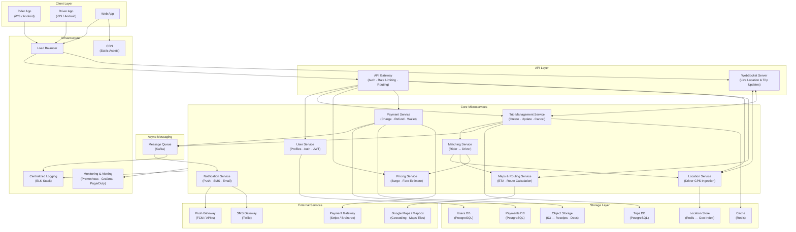

# Uber — High Level System Design

---

## Overview

Uber is a real-time ride-hailing platform that matches riders with nearby drivers, handles dynamic pricing, processes payments, and tracks live location — all at massive global scale (100M+ users, millions of concurrent trips).

---

## System Design Diagram



---

## Component Breakdown

### Client Layer
| Client | Role |
|--------|------|
| **Rider App** | Request rides, track driver in real time, pay, rate |
| **Driver App** | Accept trips, navigate, manage earnings |
| **Web App** | Booking, account management, support |

---

### API Layer

**API Gateway**
- Single entry point — handles JWT authentication, rate limiting, and request routing to the correct microservice.

**WebSocket Server**
- Maintains persistent connections with both the rider and driver app for real-time bi-directional updates: driver location pings every 3–5 seconds, trip status changes, and ETA updates.

---

### Core Microservices

| Service | Responsibility |
|---------|---------------|
| **User Service** | Registration, login, JWT issuance, profile management |
| **Trip Management** | Lifecycle of a trip: requested → matched → in-progress → completed → cancelled |
| **Matching Service** | Finds the closest available driver using geospatial queries on Redis; handles re-matching on cancellation |
| **Pricing Service** | Calculates base fare and applies surge multiplier based on local supply/demand ratio |
| **Location Service** | Ingests high-frequency GPS pings from driver apps and updates Redis geo index |
| **Maps & Routing** | Computes ETAs, turn-by-turn routes, and distance using Google Maps / Mapbox |
| **Notification Service** | Sends push notifications (FCM/APNs), SMS (Twilio), and emails for trip events |
| **Payment Service** | Charges the rider's saved card, handles refunds, driver payouts, and wallet credits |

---

### Async Messaging — Kafka

Events published to Kafka decouple time-sensitive services from slower downstream work:

| Event | Consumers |
|-------|-----------|
| `trip.completed` | Payment Service, Notification Service, Analytics |
| `payment.charged` | Notification Service (receipt email), Audit Log |
| `driver.location` | WebSocket Server (fan-out to rider), ETA recalculation |

---

### Storage Layer

| Store | Technology | Why |
|-------|-----------|-----|
| **Users DB** | PostgreSQL | Relational, ACID — user profiles & auth |
| **Trips DB** | PostgreSQL | Strong consistency for financial-adjacent trip records |
| **Location Store** | Redis (GEO commands) | Sub-millisecond geospatial nearest-driver queries |
| **Cache** | Redis | Trip state hot cache, session tokens, surge pricing data |
| **Payments DB** | PostgreSQL | ACID compliance required for financial records |
| **Object Storage** | AWS S3 | Trip receipts, driver documents, profile images |

---

### External Services

| Service | Provider | Purpose |
|---------|---------|---------|
| Maps & Geocoding | Google Maps / Mapbox | Route calculation, ETA, geocoding pickup/dropoff |
| Payment Processing | Stripe / Braintree | Card charging, payouts |
| Push Notifications | FCM (Android) / APNs (iOS) | Trip alerts, driver arrival |
| SMS | Twilio | OTP verification, trip confirmations |

---

## Key Design Decisions

### 1. Real-Time Driver Location
- Driver apps send GPS pings every **3–5 seconds** to the Location Service via the WebSocket Server.
- Stored in **Redis** using `GEOADD` / `GEORADIUS` for O(log n) nearest-driver lookup.
- Fan-out to the rider's live map happens via the WebSocket Server.

### 2. Matching Algorithm
- Matching Service queries Redis GEO index for drivers within a radius.
- Filters by availability, vehicle type, and driver rating.
- Sends a push notification to the selected driver; waits for acceptance (timeout → re-match).

### 3. Surge Pricing
- Pricing Service continuously monitors supply (available drivers) vs demand (open requests) per geo cell (H3 hexagons).
- Surge multiplier is cached in Redis with a short TTL and recomputed every 30 seconds.

### 4. Fault Tolerance
- **Circuit Breaker** on all external service calls (Maps, Payment Gateway).
- **Kafka** ensures notifications and payment events are processed at least once even if a service is temporarily down.
- **PostgreSQL read replicas** serve analytics and reporting without impacting write throughput.

### 5. Scalability
- Stateless microservices auto-scale horizontally behind the load balancer.
- WebSocket Server uses consistent hashing to pin a rider-driver pair to the same server node.
- Kafka partitioned by `trip_id` to preserve event ordering per trip.

---

## Data Flow — Happy Path

```
Rider requests trip
  → API Gateway (auth check)
    → Trip Management Service (create trip record)
      → Matching Service (query Redis GEO for nearby drivers)
        → Push notification to closest driver
          → Driver accepts
            → WebSocket broadcasts driver location to Rider every 5s
              → Driver picks up Rider
                → Trip completed
                  → Payment Service charges card
                    → Kafka event → Notification Service → receipt email/push
```

---

## Scale Numbers (approximate)

| Metric | Value |
|--------|-------|
| Daily Active Riders | ~100 million |
| Daily Trips | ~25 million |
| Driver Location Updates/sec | ~1 million |
| Peak Matching Latency | < 500 ms |
| Surge Pricing Refresh | Every 30 sec |
| Data Replication | Multi-region (active-active) |
