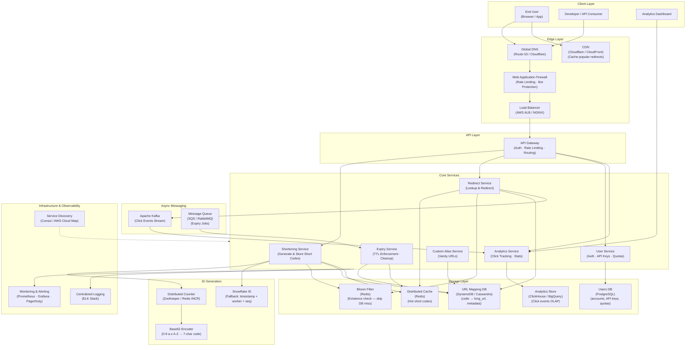

# URL Shortener — High Level System Design

---

## Overview

A URL Shortener (e.g., bit.ly, TinyURL) converts long URLs into compact, shareable short links and redirects users to the original URL when the short link is visited. It must handle massive read traffic (redirects far outnumber writes), generate globally unique short codes, persist mappings durably, and deliver sub-millisecond redirect latency at global scale.

**Core operations:**
- **Write:** `POST /shorten` → accept long URL, return short code
- **Read:** `GET /{code}` → look up code, return `301/302` redirect to original URL

---

## System Design Diagram



---

## Component Breakdown

### Client Layer

| Client | Details |
|--------|---------|
| **End User** | Visits short URL in browser; expects near-instant redirect |
| **Developer / API Consumer** | Calls POST /shorten via API key to create short links programmatically |
| **Analytics Dashboard** | Queries click stats, geographic breakdown, referrer data per short code |

---

### Edge Layer

| Component | Role |
|-----------|------|
| **Global DNS** | Routes users to the nearest region; latency-based routing (Route 53 / Cloudflare) |
| **CDN** | Caches `301` redirects for popular short codes at edge PoPs; eliminates origin hits for hot links |
| **WAF** | Blocks abusive bots, rate-limits aggressive crawlers, prevents URL spam |
| **Load Balancer** | Distributes HTTP traffic across Redirect and Shortening Service instances |

---

### Core Services

| Service | Responsibility |
|---------|---------------|
| **Shortening Service** | Validates long URL, generates unique short code, stores mapping, returns short link |
| **Redirect Service** | Looks up short code (cache → DB), returns `301`/`302` redirect; emits click event |
| **Analytics Service** | Consumes click events from Kafka; aggregates click count, geo, device, referrer |
| **User Service** | Registration, login, API key issuance, per-user quota enforcement |
| **Custom Alias Service** | Handles vanity/custom short codes (e.g., `/brand-name`), checks uniqueness |
| **Expiry Service** | Scans for TTL-expired URLs, deletes mappings, invalidates cache entries |

---

### ID Generation — Short Code Strategy

The core challenge: generating a **7-character Base62 code** that is short, unique, and not guessable.

```
Base62 alphabet: 0-9 a-z A-Z  (62 characters)
7 characters    → 62^7 = ~3.5 trillion unique codes
```

**Approach 1 — Distributed Counter + Base62 Encoding (preferred)**
```
1. Atomic increment a global counter (Redis INCR or ZooKeeper sequence)
2. Convert integer → Base62 string  (e.g., 1000000 → "4c92")
3. Store mapping: code → { long_url, user_id, created_at, expires_at }
```
- **Pro:** No collision checks needed; sequential IDs encode predictably
- **Con:** Counter is a single point of failure → mitigate with range-based pre-allocation per server

**Approach 2 — Hash + Truncate**
```
1. MD5 / SHA-256 the long URL
2. Take first 7 chars of Base62-encoded hash
3. Check collision → retry with next 7 chars if taken
```
- **Pro:** Same URL always produces same code (deduplication free)
- **Con:** Collision probability grows with scale; retry logic adds latency

**Approach 3 — Snowflake ID**
```
[timestamp 41 bits][worker ID 10 bits][sequence 12 bits] → Base62 encode
```
- **Pro:** Globally unique without coordination; embeds time for ordering
- **Con:** Longer encoded string; requires worker ID assignment

---

### Redirect Flow (Critical Path)

```
User visits https://short.ly/xK9mP2q
  → CDN checks edge cache → HIT → immediate 301 redirect (< 5ms)
  → CDN MISS → request reaches Redirect Service
      → Redis cache lookup → HIT → 301 redirect + emit click event to Kafka
      → Redis MISS → Bloom filter check (does code exist?)
          → Bloom filter says NO → return 404 (skip DB entirely)
          → Bloom filter says YES → DynamoDB lookup
              → Found → cache result in Redis (TTL 24h) → 301 redirect
              → Not found → return 404
```

**301 vs 302 Redirect:**

| Code | Meaning | Cache Behavior | Use Case |
|------|---------|---------------|----------|
| **301** | Permanent redirect | Browser caches forever | Long-lived links (better performance) |
| **302** | Temporary redirect | Not cached by browser | Analytics-critical links (every click tracked) |

---

### Storage Layer

| Store | Technology | Why |
|-------|-----------|-----|
| **URL Mapping DB** | DynamoDB / Cassandra | Key-value access pattern; `code` as partition key; high read throughput; horizontal scale |
| **Users DB** | PostgreSQL | Relational — user accounts, API keys, billing, quota tracking |
| **Distributed Cache** | Redis | Sub-millisecond lookup for hot short codes; 80%+ of traffic served from here |
| **Analytics Store** | ClickHouse / BigQuery | Column-oriented OLAP; fast aggregation over billions of click events |
| **Bloom Filter** | Redis (bitfield) | Probabilistic existence check; eliminates DB reads for invalid/expired codes |

---

### Async Messaging Architecture

| Layer | Technology | Purpose |
|-------|-----------|---------|
| **Click event stream** | Apache Kafka | Every redirect emits a click event; Analytics Service consumes async — no latency added to redirect |
| **Expiry job queue** | SQS / RabbitMQ | Expiry Service processes TTL cleanup in background; decouples from main path |

**Key event flows:**

| Event | Producer | Consumers |
|-------|----------|-----------|
| `url.created` | Shortening Service | Analytics (register new link), Bloom Filter update |
| `url.clicked` | Redirect Service | Analytics (increment click count, geo, device, referrer) |
| `url.expired` | Expiry Service | Cache invalidation, DB soft-delete |

---

### Key Design Decisions

#### 1. Cache-First Redirect (Read Heavy Optimization)
Redirect traffic dwarfs write traffic by orders of magnitude (100:1 or more). Redis sits in front of every DB read. Cache hit rate targets 90%+. Popular short codes (viral links) are pre-warmed into CDN edge nodes for zero-origin redirects.

#### 2. Bloom Filter for 404 Fast-Path
Without a Bloom filter, every invalid or expired short code results in a DynamoDB read. With a Bloom filter (stored in Redis as a bitfield):
- False positive rate ~1% → 1% of 404s hit the DB unnecessarily (acceptable)
- 99% of invalid codes are rejected at the cache layer in microseconds

#### 3. Pre-Allocated ID Ranges (Counter Scalability)
Instead of a single global Redis counter, each Shortening Service instance reserves a **range** of IDs (e.g., 1M at a time) from ZooKeeper. It exhausts its local range before requesting the next batch. This removes the counter from the hot path.

#### 4. URL Deduplication
If the same long URL is shortened twice by the same user, optionally return the existing short code (deduplicate). Hash the long URL and maintain a secondary index: `long_url_hash → code`. Trade-off: saves DB space but adds a lookup on every write.

#### 5. Custom Aliases and Namespace Collision
Custom aliases share the same code namespace as auto-generated codes. Reserved prefixes (e.g., `api`, `admin`, `health`) are blocked at the Custom Alias Service. Custom codes are stored in the same URL Mapping DB; uniqueness enforced via conditional write (DynamoDB `condition_expression`).

#### 6. Link Expiry
Each URL mapping stores an `expires_at` timestamp. The Expiry Service runs periodic scans (or uses DynamoDB TTL) to delete expired records and publish `url.expired` events. Redis entries use matching TTLs so they auto-evict without manual invalidation.

---

## Data Flow — Shorten URL (Happy Path)

```
Developer calls POST /shorten { "url": "https://very-long-url.com/path?q=..." }
  → API Gateway authenticates API key → checks rate limit quota
    → Shortening Service validates URL (format + safe browsing check)
      → Fetch next ID range from ZooKeeper counter
        → Encode integer to Base62 → "xK9mP2q"
          → Write to DynamoDB: { code: "xK9mP2q", long_url: "...", user_id, expires_at }
            → Add code to Redis Bloom Filter
              → Cache entry in Redis (TTL 24h)
                → Publish url.created event to Kafka
                  → Return { short_url: "https://short.ly/xK9mP2q" }
```

---

## Data Flow — Redirect (Happy Path)

```
User visits https://short.ly/xK9mP2q
  → CDN edge — cache HIT → 301 redirect returned immediately
  ─── cache MISS ───
  → Load Balancer → Redirect Service
    → Redis GET "xK9mP2q" → HIT → emit click event to Kafka → return 301
    ─── Redis MISS ───
    → Bloom Filter CHECK → code exists
      → DynamoDB GET "xK9mP2q" → return long URL
        → Cache in Redis (TTL 24h)
          → emit click event to Kafka
            → return 301 redirect to long URL
```

---

## Scale Numbers (approximate)

| Metric | Value |
|--------|-------|
| Write QPS (URL creation) | ~1,000/sec |
| Read QPS (redirects) | ~100,000/sec |
| Read/Write ratio | ~100:1 |
| Short code length | 7 characters (Base62) |
| Unique codes possible | ~3.5 trillion |
| URLs stored (5-year horizon) | ~30 billion |
| Storage per URL record | ~500 bytes → ~15 TB total |
| Cache hit target | 90%+ |
| P99 redirect latency (cached) | < 10ms |
| P99 redirect latency (DB) | < 50ms |
| CDN edge PoPs | 200+ worldwide |
| Uptime SLA | 99.99% |
