# WhatsApp — High Level System Design

---

## Overview

WhatsApp is the world's most popular messaging app with 2B+ active users exchanging 100B+ messages per day across 180+ countries. It provides real-time 1-on-1 messaging, group chats (up to 1,024 members), voice/video calls, media sharing, and end-to-end encrypted (E2EE) communication — all with sub-second delivery latency and 99.9%+ uptime.

---

## System Design Diagram

```mermaid
flowchart TD
    subgraph Clients["Client Layer"]
        AND["Android App"]
        IOS["iOS App"]
        WEB["WhatsApp Web\n(Browser)"]
        DESK["Desktop App\n(Windows / Mac)"]
    end

    subgraph Edge["Edge & Connection Layer"]
        DNS["Global DNS\n(Anycast)"]
        LB["Load Balancer\n(L4 — TCP)"]
        WAF["DDoS Protection\n(Cloudflare / Custom)"]
    end

    subgraph Gateway["Gateway Layer"]
        CONN["Connection Gateway\n(WebSocket / XMPP)\n(Persistent TCP connections)"]
        AG["REST API Gateway\n(Auth · Registration · Media URLs)"]
    end

    subgraph Core["Core Microservices"]
        US["User Service\n(Registration · Auth · Profile · Contacts)"]
        MS["Messaging Service\n(Route · Store · Deliver · Receipts)"]
        GS["Group Service\n(Create · Members · Admin · Settings)"]
        MED["Media Service\n(Upload URL · Download URL · Dedup)"]
        PRES["Presence Service\n(Online · Offline · Last Seen · Typing)"]
        CALL["Call Service\n(VoIP Signaling · WebRTC · E2EE)"]
        STATUS["Status / Stories Service\n(24-hr Ephemeral Stories)"]
        NS["Notification Service\n(FCM · APNs — offline push)"]
        KEY["Key Distribution Service\n(Signal Protocol · Public Keys)"]
        SPAM["Spam & Safety Service\n(Abuse Detection · Ban)"]
    end

    subgraph E2EE["End-to-End Encryption Layer (Signal Protocol)"]
        X3DH["X3DH Key Agreement\n(Session Establishment)"]
        DR["Double Ratchet Algorithm\n(Per-message Key Rotation)"]
    end

    subgraph MsgFlow["Message Delivery Pipeline"]
        INBOX["Recipient Inbox\n(Offline Message Queue)"]
        ACK["Delivery & Read\nReceipt Engine\n(✓ sent · ✓✓ delivered · ✓✓ read)"]
    end

    subgraph Messaging["Async Messaging"]
        MQ["Message Queue\n(Kafka)\n(Events · Receipts · Audit)"]
    end

    subgraph MediaPipeline["Media Processing Pipeline"]
        UPLOAD["Chunked Upload\n(Resumable)"]
        COMPRESS["Media Compression\n(Images · Video · Audio)"]
        ENCRYPT_M["Client-Side Encryption\n(AES-256 before upload)"]
        MSTORE["Encrypted Media Store\n(Blob Storage — S3 / Facebook CDN)"]
    end

    subgraph VoiceVideo["Voice & Video Calls"]
        STUN["STUN / TURN Servers\n(WebRTC NAT Traversal)"]
        RELAY["Media Relay Servers\n(SRTP — fallback when P2P fails)"]
    end

    subgraph Storage["Storage Layer"]
        USERDB["Users DB\n(HBase / MySQL — sharded)"]
        MSGDB["Message Store\n(HBase — transient until delivered)"]
        GRPDB["Groups DB\n(HBase / MySQL)"]
        MEDIADB["Media Metadata DB\n(MySQL — file keys · expiry)"]
        PRESDB["Presence Store\n(Redis — TTL-based online status)"]
        KEYDB["Key Store\n(Cryptographic public keys — MySQL)"]
        CACHE["Cache\n(Memcached / Redis)"]
        S3["Encrypted Media Blob Store\n(S3-compatible)"]
    end

    subgraph Analytics["Analytics & Safety"]
        STREAM["Stream Processing\n(Apache Flink)"]
        DW["Data Warehouse\n(Hive / Presto)"]
        SPAMML["Spam Detection ML\n(Graph-based · Behavioural)"]
        AUDIT["Audit Log\n(Compliance · Law Enforcement)"]
    end

    subgraph Infra["Infrastructure & Observability"]
        SD["Service Discovery\n(ZooKeeper)"]
        MON["Monitoring\n(Prometheus · Grafana · Alerts)"]
        LOG["Centralized Logging\n(ELK Stack)"]
    end

    %% Clients → Edge
    AND & IOS & WEB & DESK --> DNS
    DNS --> WAF --> LB

    %% LB → Gateway
    LB --> CONN
    LB --> AG

    %% Connection gateway keeps persistent WebSocket
    CONN <-->|"persistent\nWebSocket"| AND & IOS & WEB & DESK

    %% REST API
    AG --> US
    AG --> GS
    AG --> MED
    AG --> STATUS
    AG --> CALL

    %% Messaging flow
    CONN --> MS
    MS --> E2EE
    E2EE --> X3DH & DR
    MS --> INBOX
    MS --> ACK
    INBOX --> CONN
    ACK --> MQ

    %% Presence
    CONN --> PRES
    PRES --> PRESDB

    %% Group messaging
    MS --> GS
    GS --> GRPDB

    %% Notifications for offline users
    MS --> NS
    NS -->|"offline push"| AND & IOS

    %% Key distribution
    US --> KEY
    KEY --> KEYDB

    %% Media pipeline
    MED --> UPLOAD --> ENCRYPT_M --> COMPRESS --> MSTORE
    MSTORE --> S3
    MED --> MEDIADB

    %% Voice/Video calls
    CALL --> STUN
    CALL --> RELAY

    %% Kafka events
    MS --> MQ
    MQ --> STREAM
    MQ --> AUDIT
    STREAM --> DW
    DW --> SPAMML --> SPAM

    %% Service → Storage
    US --> USERDB
    MS --> MSGDB
    MS --> CACHE
    GS --> GRPDB

    %% Observability
    Core --> MON
    Core --> LOG
    SD -.-> Core
```



---

## Component Breakdown

### Client Layer

| Client | Details |
|--------|---------|
| **Android / iOS** | Native apps; maintain persistent WebSocket; local SQLite message DB |
| **WhatsApp Web** | Browser-based; mirrors the phone — messages relayed through the paired mobile device |
| **Desktop App** | Electron wrapper; same architecture as Web client; supports multi-device since 2021 |

---

### Connection Gateway — WebSocket / XMPP

The most critical infrastructure component. WhatsApp maintains a **persistent TCP/WebSocket connection** for every online device:

- Built on **Erlang/OTP** — designed for millions of concurrent lightweight processes
- Each connection server handles hundreds of thousands of simultaneous connections
- Heartbeat pings every 30 seconds keep connections alive through NAT/firewalls
- On reconnect, client fetches queued offline messages immediately
- Connection servers are stateless routing nodes — they don't store messages

---

### Core Microservices

| Service | Responsibility |
|---------|---------------|
| **User Service** | Phone number registration (OTP via SMS), contact sync, profile photo, about text |
| **Messaging Service** | Routes messages between users, manages delivery state machine, fan-out for groups |
| **Group Service** | Group creation, member management (add/remove/admin), settings, invite links |
| **Media Service** | Issues pre-signed upload/download URLs; deduplicates identical files by hash |
| **Presence Service** | Tracks online/offline status, last seen timestamp, typing indicators |
| **Call Service** | WebRTC signaling for 1-on-1 and group calls (up to 32 participants) |
| **Status / Stories** | 24-hour ephemeral photo/video stories; delivered to contacts only |
| **Notification Service** | Sends FCM (Android) / APNs (iOS) push when user is offline |
| **Key Distribution** | Stores and serves Signal Protocol public keys for E2EE session setup |
| **Spam & Safety** | Detects forwarding abuse, account bans, spam rings using graph ML |

---

### End-to-End Encryption — Signal Protocol

WhatsApp uses the **Signal Protocol**, the gold standard for E2EE messaging:

```
Session Setup (X3DH — Extended Triple Diffie-Hellman):
  Sender fetches recipient's public key bundle from Key Distribution Service
    → X3DH key agreement derives a shared secret
      → Initial encrypted session established without server seeing plaintext

Per-Message Encryption (Double Ratchet Algorithm):
  Every message uses a NEW encryption key derived from the previous one
    → Compromising one message key does NOT expose past or future messages
      → Server only ever stores and forwards ciphertext — never plaintext

Group Messaging:
  Sender encrypts the message once per group member (individual sessions)
    → No shared group key — each member's copy is independently encrypted
```

**What WhatsApp cannot see:** Message content, media, calls, group names, profile photos.
**What WhatsApp can see:** Metadata — who messaged whom, when, how often, message size (not content).

---

### Message Delivery Pipeline & Receipts

WhatsApp's **three-tick receipt system** maps to precise delivery states:

```
Sender types and sends message
  → Client encrypts locally (Signal Protocol)
    → Sends ciphertext to Messaging Service via WebSocket
      → ✓ (one grey tick) — Server acknowledges receipt
        → Messaging Service checks if recipient is online
          [ONLINE]  → Delivers directly over WebSocket
          [OFFLINE] → Stores in Recipient Inbox (HBase queue)
                      → Triggers push notification (FCM/APNs)
                      → Delivered on next connection
            → ✓✓ (two grey ticks) — Delivered to recipient device
              → Recipient opens chat / reads message
                → ✓✓ (two blue ticks) — Read receipt sent back to sender
```

**Key design:** Messages are stored server-side **only until delivered**. Once all recipient devices acknowledge delivery, the server deletes its copy. WhatsApp is not a message archive — it is a delivery pipeline.

---

### Group Messaging Fan-out

Group chats (up to 1,024 members) require careful fan-out design:

```
Sender sends message to group
  → Messaging Service looks up group membership (cached in Redis)
    → For each online member → deliver via WebSocket connection
    → For each offline member → write to their Inbox queue + push notification
      → ✓✓ shown only when ALL members have received
      → Blue ticks shown when ALL members have read (optional, can be disabled)
```

For very large groups, fan-out is parallelized across multiple Messaging Service workers.

---

### Media Sharing Pipeline

Media is handled separately from the messaging channel to avoid blocking text delivery:

```
Sender selects photo/video/document
  → Client compresses + re-encodes (reduce size)
    → Client encrypts with AES-256 (E2EE — key sent in the message payload)
      → Client uploads encrypted blob to Media Service (chunked, resumable)
        → Media Service deduplicates by SHA-256 hash (same file = same storage blob)
          → Stores in S3-compatible encrypted blob store
            → Returns download URL + media key
              → Sender's message contains: download URL + encrypted media key
                → Recipient downloads blob → decrypts with key from message
```

**Media expiry:** WhatsApp servers delete media after **30 days** from upload. Recipients must download before expiry.

---

### Voice & Video Calls — WebRTC

```
Caller initiates call
  → Call Service sends signaling message (SDP offer) via WebSocket to callee
    → STUN server helps both parties discover their public IP/port
      → Attempt direct P2P connection (works in ~80% of cases)
        [P2P fails — symmetric NAT] → fall back to TURN/Relay server
          → Encrypted SRTP audio/video stream flows
            → Call Service monitors quality metrics (jitter, packet loss)
```

All calls are **end-to-end encrypted** — even relay servers only see encrypted SRTP packets.

---

### Presence Service

| State | Storage | TTL |
|-------|---------|-----|
| **Online** | Redis key per user | 30s (renewed by heartbeat) |
| **Typing** | Redis key | 5s |
| **Last Seen** | MySQL | Persistent |

Presence updates are **fanned out only to contacts** who have the user in their contact list — not to all users. This prevents the presence service from becoming a broadcast bottleneck.

---

### Async Messaging — Kafka

| Event | Consumers |
|-------|-----------|
| `message.sent` | Delivery receipt engine, Analytics |
| `message.delivered` | Receipt engine → sender notification |
| `message.read` | Receipt engine → sender blue ticks |
| `media.uploaded` | Dedup check, CDN pre-warm |
| `call.initiated` | Analytics, abuse detection |
| `user.banned` | Account service, group membership cleanup |

---

### Storage Layer

| Store | Technology | Why |
|-------|-----------|-----|
| **Users DB** | MySQL (sharded) | Relational — phone numbers, contacts, profile data |
| **Message Store** | HBase | High write throughput; messages are transient — deleted after delivery |
| **Groups DB** | HBase / MySQL | Group metadata and membership lists |
| **Presence Store** | Redis | TTL-based expiry perfectly models online/offline transitions |
| **Key Store** | MySQL | Signal Protocol public keys — strong consistency required |
| **Media Metadata** | MySQL | File hash, S3 key, expiry, size |
| **Cache** | Memcached / Redis | Contact lists, group membership, session tokens |
| **Encrypted Blob Store** | S3-compatible | All media — never decryptable at rest by WhatsApp |

---

### Key Design Decisions

#### 1. Erlang/OTP for Connection Servers
WhatsApp's connection layer runs on **Erlang** — a language built for telecom-grade concurrency. Each user connection is a lightweight Erlang process (a few KB). A single server handles **millions of concurrent connections**, something impossible with thread-per-connection models.

#### 2. Messages Are Not Stored Long-Term
Unlike email or Slack, WhatsApp is a **delivery system, not an archive**. Messages live on the server only as long as needed for delivery. This minimizes data breach exposure — there is no central plaintext message database to steal.

#### 3. Phone Number as Identity
No usernames or passwords — only phone number + OTP SMS verification. This simplifies contact discovery (your contacts ARE your address book) but ties identity to a SIM card.

#### 4. Multi-Device Without a Primary Device (2021 Architecture Shift)
Before 2021, WhatsApp Web/Desktop required the phone to be online (it acted as a relay). The 2021 multi-device redesign gave each device its own Signal Protocol identity, allowing up to **4 linked devices** to receive messages independently — even when the phone is offline.

#### 5. Metadata vs. Content Trade-off
E2EE protects message content perfectly, but WhatsApp (and Meta) can still observe **communication metadata**: who talks to whom, how frequently, at what time, and from what location. This metadata is valuable for ad targeting and is subject to law enforcement requests in many jurisdictions.

---

## Data Flow — 1-on-1 Message (Happy Path)

```
Alice types "Hey!" and hits Send
  → WhatsApp client fetches Bob's public key from Key Distribution Service (cached)
    → Encrypts "Hey!" using Signal Protocol Double Ratchet
      → Sends ciphertext to Messaging Service via persistent WebSocket
        → Server stores ciphertext in HBase inbox
          → ✓ (grey tick) — Alice sees server ACK
            → Bob is online → Messaging Service pushes to Bob's WebSocket connection
              → Bob's device decrypts using local Signal session key
                → ✓✓ (grey ticks) — delivery ACK sent back via Bob's WebSocket
                  → Server deletes message from HBase
                    → Bob opens chat → reads message
                      → ✓✓ (blue ticks) — read receipt to Alice (if not disabled)
```

---

## Scale Numbers (approximate)

| Metric | Value |
|--------|-------|
| Monthly Active Users | 2 billion+ |
| Messages / Day | 100 billion+ |
| Media Files Shared / Day | 7 billion+ |
| Voice / Video Minutes / Day | 2 billion+ |
| Countries | 180+ |
| Peak Concurrent Connections | Hundreds of millions |
| Engineers (at acquisition, 2014) | ~55 (for 450M users) |
| Group Chat Max Members | 1,024 |
| Linked Devices per Account | Up to 4 |
| Message Server Retention | Until delivered (then deleted) |
| Media Server Retention | 30 days |
