# X (formerly Twitter) — High Level System Design

---

## Overview

X is a real-time social media platform serving 500M+ registered users and 250M+ daily active users worldwide. Users post short-form content (posts/tweets), follow other users, receive a personalized feed, and engage via likes, replies, reposts, and direct messages. The defining engineering challenge is the **fan-out problem**: when a celebrity with 100M followers posts, their content must appear in 100M feeds — ideally within seconds.

**Core operations:**
- **Post:** Create a tweet (text, media, poll, thread)
- **Timeline:** Serve a personalized, ranked feed of posts from followed accounts
- **Follow:** Establish directed follow relationships between users
- **Engage:** Like, repost, reply, quote-tweet
- **Search:** Full-text and trending topic discovery
- **DM:** Encrypted direct messaging between users

---

## System Design Diagram

```mermaid
flowchart TD
    subgraph Clients["Client Layer"]
        WEB["Web Browser\n(x.com)"]
        MOB["Mobile App\n(iOS / Android)"]
        API_CON["Third-party Apps\n(X API v2)"]
    end

    subgraph Edge["Edge Layer"]
        DNS["Global DNS\n(Anycast / Route 53)"]
        CDN["CDN\n(Cloudflare / Akamai)\n(Media · Static Assets)"]
        WAF["Web Application Firewall\n(DDoS · Abuse · Bot)"]
        LB["Load Balancer\n(L7 / HAProxy / AWS ALB)"]
    end

    subgraph Gateway["API Layer"]
        AG["API Gateway\n(Auth · Rate Limiting · Routing)"]
    end

    subgraph Core["Core Services"]
        AUTH["Auth Service\n(OAuth2 · JWT · 2FA)"]
        USER["User Service\n(Profiles · Settings · Verification)"]
        TWEET["Tweet Service\n(Create · Delete · Thread)"]
        TIMELINE["Timeline Service\n(Home Feed · User Feed · Ranked)"]
        FANOUT["Fan-out Service\n(Push / Pull · Celebrity Hybrid)"]
        FOLLOW["Follow / Graph Service\n(Follower · Following · Block · Mute)"]
        ENGAGE["Engagement Service\n(Like · Repost · Reply · Bookmark)"]
        MEDIA["Media Service\n(Upload · Transcode · Store)"]
        SEARCH["Search Service\n(Full-text · Hashtags · Trending)"]
        NOTIFY["Notification Service\n(Push · Email · In-app)"]
        DM["Direct Message Service\n(Encrypted · Group DMs)"]
        TREND["Trending Service\n(Real-time Topic Detection)"]
        RECOMMEND["Recommendation Service\n(Who to Follow · Explore)"]
        MODERATION["Trust & Safety Service\n(Spam · Abuse · CSAM Detection)"]
        ADS["Ads Service\n(Targeting · Auction · Insertion)"]
    end

    subgraph Messaging["Async Messaging"]
        KAFKA["Apache Kafka\n(Tweet · Engagement · Follow Events)"]
        SQS["SQS / Celery\n(Background Job Queues)"]
    end

    subgraph Storage["Storage Layer"]
        TWEET_DB["Tweet Store\n(Manhattan / MySQL)\n(Tweet data · metadata)"]
        USER_DB["User DB\n(MySQL / PostgreSQL)\n(Profiles · Auth)"]
        GRAPH_DB["Social Graph\n(FlockDB / Redis)\n(Follow relationships)"]
        TIMELINE_CACHE["Timeline Cache\n(Redis)\n(Pre-built feed per user)"]
        MEDIA_STORE["Media Store\n(S3 / GCS)\n(Images · Videos · GIFs)"]
        SEARCH_IDX["Search Index\n(Earlybird / Lucene)\n(Real-time tweet index)"]
        CACHE["Hot Cache\n(Redis / Memcached)\n(Tweets · Counts · Sessions)"]
        DM_STORE["DM Store\n(Encrypted · HBase / Cassandra)"]
        DW["Data Warehouse\n(BigQuery / Hadoop)\n(Analytics · ML features)"]
    end

    subgraph ML["ML & Ranking Platform"]
        RANK["Ranking Engine\n(SimClusters · Neural Ranker)"]
        REC_MODEL["Who-to-Follow Model\n(Graph embeddings)"]
        TREND_MODEL["Trending Detection\n(Anomaly detection on counts)"]
        SAFETY_ML["Safety ML\n(Hate speech · Spam · Deepfake)"]
    end

    subgraph Infra["Infrastructure & Observability"]
        MON["Monitoring\n(Prometheus · Grafana · PagerDuty)"]
        LOG["Centralized Logging\n(ELK Stack / Splunk)"]
        CICD["CI/CD\n(Kubernetes · Spinnaker)"]
    end

    %% Client → Edge
    WEB & MOB & API_CON --> DNS
    DNS --> WAF --> LB
    MOB & WEB --> CDN

    %% Edge → Gateway
    LB --> AG

    %% Gateway → Core Services
    AG --> AUTH
    AG --> USER
    AG --> TWEET
    AG --> TIMELINE
    AG --> FOLLOW
    AG --> ENGAGE
    AG --> MEDIA
    AG --> SEARCH
    AG --> DM
    AG --> RECOMMEND

    %% Tweet creation flow
    TWEET --> MODERATION
    TWEET --> MEDIA
    TWEET --> KAFKA
    TWEET --> TWEET_DB
    TWEET --> CACHE

    %% Fan-out
    KAFKA --> FANOUT
    FANOUT --> TIMELINE_CACHE
    FANOUT --> NOTIFY

    %% Timeline assembly
    TIMELINE --> TIMELINE_CACHE
    TIMELINE --> TWEET_DB
    TIMELINE --> RANK
    TIMELINE --> ADS

    %% Follow / Graph
    FOLLOW --> GRAPH_DB
    FOLLOW --> KAFKA

    %% Engagement
    ENGAGE --> TWEET_DB
    ENGAGE --> CACHE
    ENGAGE --> KAFKA

    %% Media
    MEDIA --> MEDIA_STORE
    MEDIA --> CDN

    %% Search & Trending
    KAFKA --> SEARCH --> SEARCH_IDX
    KAFKA --> TREND --> TREND_MODEL
    TREND --> SEARCH_IDX

    %% Notifications
    NOTIFY --> MOB
    NOTIFY --> WEB

    %% ML
    KAFKA --> DW
    DW --> RANK
    DW --> REC_MODEL --> RECOMMEND
    DW --> SAFETY_ML --> MODERATION

    %% Storage
    USER --> USER_DB
    DM --> DM_STORE

    %% Observability
    Core --> MON
    Core --> LOG
```



---

## Component Breakdown

### Client Layer

| Client | Details |
|--------|---------|
| **Web Browser** | React SPA; server-side rendered tweet/profile pages for SEO; WebSocket for real-time feed updates |
| **Mobile App** | iOS / Android; native push notifications; offline read cache; optimistic UI for likes and reposts |
| **Third-party Apps** | X API v2 consumers; OAuth2 app-only and user-context tokens; rate-limited per tier |

---

### Edge Layer

| Component | Role |
|-----------|------|
| **Global DNS** | Anycast routing; users land on the nearest data center (US East, US West, EU, AP) |
| **CDN** | Serves images, videos, GIFs, and static JS/CSS from edge PoPs; video is HLS-streamed at edge |
| **WAF** | Blocks DDoS, credential stuffing, bot scraping; enforces per-IP and per-token rate limits |
| **Load Balancer** | L7 routing; separates read traffic (timeline) from write traffic (tweet creation) |

---

### Core Services

| Service | Responsibility |
|---------|---------------|
| **Auth Service** | OAuth2, JWT, 2FA (TOTP/SMS), session management, API key issuance |
| **User Service** | Profile CRUD, handle/username management, verification badges, privacy settings |
| **Tweet Service** | Create/delete tweets, thread stitching, character limit enforcement, content policy check trigger |
| **Timeline Service** | Assembles and ranks the home feed; merges cached pre-built timelines with real-time posts |
| **Fan-out Service** | Propagates new tweets into followers' timeline caches (push model for regular users, pull for celebrities) |
| **Follow / Graph Service** | Manages directed follow relationships, block/mute lists, follower/following counts |
| **Engagement Service** | Likes, reposts, replies, bookmarks, quote-tweets; increments denormalized counters |
| **Media Service** | Accepts image/video uploads, runs transcoding pipeline, stores in S3, serves via CDN |
| **Search Service** | Real-time full-text search over tweets, hashtags, and accounts; powers trending topics |
| **Notification Service** | Delivers push (APNs/FCM), email, and in-app notifications for mentions, likes, follows |
| **DM Service** | End-to-end encrypted direct messages; group DMs; media sharing in conversations |
| **Trending Service** | Detects anomalous spikes in hashtag/keyword velocity using streaming counts |
| **Recommendation Service** | "Who to Follow" suggestions using graph embeddings and mutual-follower signals |
| **Trust & Safety** | Real-time ML classification for spam, hate speech, CSAM, coordinated inauthentic behavior |
| **Ads Service** | Auction-based promoted tweet insertion into timelines; targeting by interest, geo, device |

---

### The Fan-out Problem (Core Design Challenge)

Fan-out is the process of delivering a new tweet to all followers' feeds. It is X's most complex scalability challenge.

**Naive approach — Pull (pure read-time fan-out):**
```
User opens app → Timeline Service queries: "get tweets from all accounts I follow"
  → N follow relationships → N DB queries → merge → sort by time → return
```
- Simple to implement
- Catastrophically slow at scale (following 1,000 accounts = 1,000 queries per feed load)

**X's approach — Push (pre-computed timeline cache):**
```
User posts tweet
  → Fan-out Service fetches follower list from Graph DB
    → For each follower: INSERT tweet_id into follower's Timeline Cache (Redis list)
      → Timeline is pre-built and waiting — feed loads in milliseconds
```
- Fast reads (single Redis lookup)
- Expensive writes (Lady Gaga tweets → 150M Redis writes)

**Hybrid fan-out (X's actual solution):**
```
Regular user (< ~20K followers)  → PUSH: tweet immediately written to all followers' caches
Celebrity user (> ~20K followers) → PULL: tweet NOT pushed; fetched at read time and merged
```

```
Timeline assembly for User A:
  1. Read pre-built timeline from Redis (tweets from regular followees — pushed)
  2. Fetch latest N tweets from each celebrity followee (pulled at read time)
  3. Merge + deduplicate
  4. Rank with ML Ranking Engine
  5. Insert ads
  6. Return to client
```

| Strategy | Write Cost | Read Cost | Used For |
|----------|-----------|-----------|---------|
| **Push (fan-out on write)** | High | Very Low | Regular users |
| **Pull (fan-out on read)** | Very Low | High | Celebrities / high-follower accounts |
| **Hybrid** | Moderate | Low | X's production approach |

---

### Timeline Ranking

X's home feed is not purely chronological — it is ML-ranked to surface the most relevant content.

**Ranking pipeline:**
```
Candidate tweets (from push cache + celebrity pull + ads)
  → Feature extraction:
      - Engagement signals (likes, reposts, replies per hour)
      - User affinity (how often you engage with this author)
      - Tweet freshness (recency score)
      - Media presence (tweets with video rank higher)
      - Network signals (accounts you follow liked this)
  → SimClusters: community-based interest embeddings
  → Neural Ranker: two-tower deep learning model scores each candidate
  → Heavy ranker re-scores top candidates
  → Filter (blocked, muted, already seen, low-quality)
  → Final ranked list → inject ads → return to client
```

---

### Tweet Indexing & Real-Time Search

X's search is unique: it must index **new tweets within seconds** and serve full-text search over billions of documents.

```
Tweet created → Kafka: tweet.created event
  → Search Service consumes event
    → Earlybird (real-time Lucene shard) indexes tweet in < 10 seconds
      → Search query hits Earlybird shards (recent, last 7 days)
      → Historical queries hit archive Lucene shards
        → Results merged, ranked by recency + engagement → returned
```

**Earlybird** (Twitter/X's open-source real-time search index):
- Partitioned by time window (recent shards are hot; old shards are cold and compacted)
- Supports operator search: `from:user`, `#hashtag`, `lang:en`, `min_faves:100`
- Powers the Trending Topics detection pipeline

---

### Trending Topics

```
Kafka tweet stream → Trending Service
  → Sliding-window count of hashtag / keyword occurrences (last 24h)
    → Anomaly detection: compare current rate vs. expected baseline
      → Spike detected → candidate trending topic
        → Trend Model filters noise (spam, bot-driven, duplicate trends)
          → Geo-personalized trending list assembled (global + local)
            → Published to Redis → served to clients in real time
```

---

### Storage Layer

| Store | Technology | Why |
|-------|-----------|-----|
| **Tweet Store** | Manhattan (X's custom KV) / MySQL | Billions of tweets; key-value access by tweet ID; sharded by tweet ID range |
| **User DB** | MySQL (sharded by user ID) | Relational profiles; strong consistency for auth and account state |
| **Social Graph** | FlockDB / Redis sorted sets | Sparse directed graph; follower/following lists stored as sorted sets keyed by user ID |
| **Timeline Cache** | Redis (list per user) | Pre-built tweet-ID lists; O(1) read; TTL-evicted for inactive users |
| **Media Store** | S3 / GCS | Images, videos, GIFs; immutable blobs keyed by media ID |
| **Search Index** | Earlybird (Lucene-based) | Real-time full-text index; sharded by time window |
| **Hot Cache** | Redis / Memcached | Tweet objects, like/repost counts, user sessions; absorbs >80% of read traffic |
| **DM Store** | HBase / Cassandra | Wide-column; conversation-partitioned; encrypted at rest |
| **Data Warehouse** | BigQuery / Hadoop HDFS | Petabyte-scale analytics; ML feature store; safety model training data |

---

### Async Messaging Architecture

| Layer | Technology | Purpose |
|-------|-----------|---------|
| **Event streaming** | Apache Kafka | All tweet, engagement, and follow events fan out to Search, Fan-out, Analytics, Safety |
| **Background jobs** | SQS / Celery | Media transcoding, notification delivery retries, account suspension sweeps |

**Key event flows:**

| Event | Producer | Consumers |
|-------|----------|-----------|
| `tweet.created` | Tweet Service | Fan-out Service, Search Indexer, Trending Service, Safety ML, Analytics |
| `tweet.deleted` | Tweet Service | Fan-out (remove from caches), Search (de-index), Timeline cleanup |
| `engagement.liked` | Engagement Service | Notification Service, Counter increment, Kafka→Analytics |
| `user.followed` | Follow Service | Fan-out Service (backfill followee's recent tweets into cache), Notification Service |
| `media.uploaded` | Media Service | Transcoding pipeline (SQS), CDN pre-warming |

---

### Key Design Decisions

#### 1. Snowflake ID — Globally Unique, Time-Ordered Tweet IDs
```
[timestamp 41 bits][datacenter 5 bits][worker 5 bits][sequence 12 bits]
Total: 63-bit integer → fits in signed 64-bit, sortable by creation time
```
Tweet IDs encode time, so chronological ordering requires no secondary index — range scans by ID are range scans by time. X open-sourced Snowflake in 2010.

#### 2. Denormalized Engagement Counters
Like and repost counts are **not computed by COUNT(*) at query time**. They are stored as denormalized integer fields on the tweet record and incremented atomically (Redis `INCR` with async persistence to DB). This makes displaying counts a single field read rather than an aggregation query.

#### 3. Timeline Cache TTL and Inactive User Handling
Pre-building timelines for 250M DAU is feasible. Pre-building for 500M registered users (many inactive) is not. X only maintains timeline caches for **active users** (logged in within the last N days). Inactive users get a cold timeline built at read time on their next login.

#### 4. Social Graph Storage (FlockDB)
Twitter/X stores follower relationships as two adjacency lists per user:
- `following_list[user_id]` → sorted set of user IDs this user follows
- `followers_list[user_id]` → sorted set of user IDs that follow this user
Stored in Redis sorted sets (score = follow timestamp) for O(log N) membership checks and O(1) range pagination. The full graph lives in a sharded MySQL backend for durability.

#### 5. Media Transcoding Pipeline
Video uploads go through an async transcoding pipeline:
```
User uploads raw video → Media Service stores original in S3
  → SQS job enqueued → Transcoding workers produce:
      - Multiple resolutions: 240p, 480p, 720p, 1080p
      - HLS segments (.ts + .m3u8 manifest)
      - Thumbnail frames
  → Transcoded assets uploaded to S3 → CDN pre-warmed
    → Tweet becomes visible to followers only after transcoding completes
```

#### 6. Read-Your-Own-Write Consistency
After posting a tweet, the author must see it in their own timeline immediately — even if replication lag means followers see it seconds later. X achieves this by:
- Writing the tweet to the author's own timeline cache synchronously (before fan-out)
- Routing the author's own requests to the primary DB replica for a short TTL window

---

## Data Flow — Tweet Creation (Happy Path)

```
User posts "Hello world" with an image
  → Tweet Service validates: length, media attachment, spam signals
    → Media Service: upload image → S3 → enqueue transcoding job
      → Tweet stored in Manhattan/MySQL with Snowflake tweet ID
        → Tweet object cached in Redis (hot cache)
          → Kafka: tweet.created event published
            → Fan-out Service:
                → Fetch follower list from FlockDB
                → Regular followers (<20K): push tweet ID into each follower's Redis timeline list
                → Celebrities (author >20K followers): skip push; pulled at read time
              → Search Service: index tweet in Earlybird within ~10 seconds
              → Trending Service: increment hashtag counters
              → Safety ML: async classification (spam / hate / sensitive)
              → Notification Service: notify @mentions and reply subscribers
```

---

## Data Flow — Home Timeline Load (Happy Path)

```
User opens X app
  → Timeline Service: GET /timeline?user_id=X&count=50
    → Redis: fetch pre-built tweet ID list (pushed tweets from regular followees)
      → Fetch latest N tweets from celebrity followees (pull at read time)
        → Merge + deduplicate tweet ID lists
          → Batch fetch tweet objects from Redis hot cache (cache hit ~90%)
            → Ranking Engine scores each tweet (affinity · engagement · freshness)
              → Ads Service inserts 1-2 promoted tweets at ranked positions
                → Return ranked, ad-injected timeline to client in < 100ms
```

---

## Scale Numbers (approximate)

| Metric | Value |
|--------|-------|
| Registered Users | 500 million+ |
| Daily Active Users | 250 million+ |
| Tweets per Day | 500 million+ |
| Peak Tweets/sec | ~6,000 |
| Timeline reads/sec | Millions |
| Fan-out writes (Lady Gaga tweet) | ~100M cache writes |
| Media uploads/day | Tens of millions |
| Search queries/day | Billions |
| Tweet index latency | < 10 seconds (real-time) |
| Home timeline P99 latency | < 100ms |
| Data stored (tweets) | Petabytes |
| CDN PoPs | 200+ worldwide |
| Kafka topics throughput | Millions of events/sec |
| Uptime SLA | 99.99% |
