# YouTube — High Level System Design

---

## Overview

YouTube is the world's largest video-sharing platform with 2.7B+ monthly active users, 500+ hours of video uploaded every minute, and 1 billion+ hours watched daily. It must handle massive concurrent uploads, real-time transcoding into dozens of formats, low-latency adaptive streaming globally, and ML-driven recommendations that drive 70% of all watch time.

---

## System Design Diagram

```mermaid
flowchart TD
    subgraph Clients["Client Layer"]
        WEB["Web Browser"]
        MOB["Mobile App\n(iOS / Android)"]
        TV["Smart TV / Console"]
        CREATOR["Creator Studio\n(Upload · Analytics · Monetization)"]
    end

    subgraph Edge["Edge Layer"]
        DNS["Global DNS\n(Anycast Routing)"]
        CDN["CDN\n(Google Edge Network)\n(Video Segments · Thumbnails · JS/CSS)"]
        LB["Load Balancer\n(Google Frontend / GLB)"]
        WAF["DDoS Protection\n(Google Cloud Armor)"]
    end

    subgraph Gateway["API Layer"]
        AG["API Gateway\n(Auth · Rate Limiting · Routing)"]
        WS["WebSocket Server\n(Live Chat · Live Stream Events)"]
    end

    subgraph Core["Core Microservices"]
        US["User Service\n(Auth · Profiles · Subscriptions · History)"]
        VS["Video Metadata Service\n(Title · Description · Tags · Visibility)"]
        SS["Search Service\n(Full-Text · Autocomplete · Ranking)"]
        RS["Recommendation Service\n(Homepage · Up Next · Trending)"]
        CS["Comment Service\n(Post · Thread · Moderate)"]
        LS["Like & Engagement Service\n(Likes · Dislikes · Shares · Saves)"]
        NS["Notification Service\n(Push · Email · In-App)"]
        AS["Analytics Service\n(Views · Watch Time · Revenue)"]
        ADS["Ad Service\n(Targeting · Auction · Delivery)"]
        LIVE["Live Streaming Service\n(Ingest · Transcode · Broadcast)"]
        MOD["Content Moderation Service\n(Policy · Copyright · CSAM)"]
    end

    subgraph Upload["Video Upload & Processing Pipeline"]
        RAW["Raw Video Upload\n(Resumable Upload API)"]
        QUEUE["Upload Queue\n(Pub/Sub)"]
        TRANS["Transcoding Farm\n(FFmpeg · VP9 · H.264 · AV1 · HDR)"]
        THUMB["Thumbnail Generator\n(Auto-select · Custom)"]
        DASH["Packaging Service\n(DASH · HLS Manifests)"]
        STORE["Encoded Video Store\n(Google Cloud Storage / Colossus)"]
    end

    subgraph Streaming["Video Delivery"]
        STRMSVC["Streaming Service\n(Manifest · Segment Resolution · ABR)"]
        EDGECACHE["Edge Cache\n(Google PoPs — 130+ locations)"]
    end

    subgraph Messaging["Async Messaging"]
        PUBSUB["Google Pub/Sub\n(Event Streaming)"]
    end

    subgraph Storage["Storage Layer"]
        USERDB["Users DB\n(Spanner — global relational)"]
        VIDDB["Video Metadata DB\n(Bigtable / Vitess)"]
        CMTDB["Comments DB\n(Spanner)"]
        ENGDB["Engagement Store\n(Bigtable — likes · views · counters)"]
        CACHE["Distributed Cache\n(Memcache / Redis)"]
        ESEARCH["Search Index\n(Custom inverted index)"]
        GCS["Object Storage\n(GCS / Colossus)\n(Raw + Encoded Video)"]
        DW["Data Warehouse\n(BigQuery)"]
    end

    subgraph ML["ML & Data Platform"]
        STREAM["Stream Processing\n(Apache Beam / Dataflow)"]
        BATCH["Batch Processing\n(MapReduce / Dataflow)"]
        RECMODEL["Recommendation Models\n(Two-Tower · Transformer · Ranking)"]
        CONTENTMOD["Content Moderation ML\n(Video · Audio · Text classifiers)"]
        ADMODEL["Ad Relevance Models\n(CTR Prediction · Brand Safety)"]
    end

    subgraph Infra["Infrastructure & Observability"]
        SD["Service Discovery\n(Google Service Mesh)"]
        MON["Monitoring\n(Google Cloud Monitoring · Alerting)"]
        LOG["Centralized Logging\n(Stackdriver / Cloud Logging)"]
        CHAOS["Reliability Engineering\n(DiRT Testing)"]
    end

    %% Clients → Edge
    WEB & MOB & TV & CREATOR --> DNS
    DNS --> WAF --> LB
    WEB & MOB & TV --> CDN

    %% Edge → API Layer
    LB --> AG
    LB --> WS

    %% Gateway → Services
    AG --> US
    AG --> VS
    AG --> SS
    AG --> RS
    AG --> CS
    AG --> LS
    AG --> AS
    AG --> ADS
    AG --> LIVE
    AG --> STRMSVC

    %% Upload pipeline
    CREATOR --> RAW --> QUEUE --> TRANS
    TRANS --> THUMB
    TRANS --> DASH
    DASH --> STORE
    STORE --> EDGECACHE

    %% Video delivery
    STRMSVC --> EDGECACHE
    EDGECACHE --> CDN

    %% Moderation triggered post-upload
    QUEUE --> MOD

    %% Async events
    VS --> PUBSUB
    LS --> PUBSUB
    US --> PUBSUB
    PUBSUB --> NS
    PUBSUB --> AS
    PUBSUB --> STREAM

    %% Service → Storage
    US --> USERDB
    VS --> VIDDB
    VS --> CACHE
    CS --> CMTDB
    LS --> ENGDB
    AS --> DW
    SS --> ESEARCH
    TRANS --> GCS

    %% ML pipeline
    STREAM --> DW
    BATCH --> DW
    DW --> RECMODEL --> RS
    DW --> CONTENTMOD --> MOD
    DW --> ADMODEL --> ADS

    %% Observability
    Core --> MON
    Core --> LOG
```



---

## Component Breakdown

### Client Layer

| Client | Details |
|--------|---------|
| **Web Browser** | React/Polymer SPA; uses Media Source Extensions (MSE) for adaptive playback |
| **Mobile App** | iOS / Android; background play, offline download (Premium), PiP support |
| **Smart TV / Console** | Dedicated SDKs for Chromecast, Roku, PlayStation, Xbox |
| **Creator Studio** | Upload dashboard, video manager, analytics, monetization settings |

---

### Edge Layer

| Component | Role |
|-----------|------|
| **Anycast DNS** | Routes users to the nearest Google data center based on network topology |
| **Google Edge Network** | 130+ PoPs serving video segments and static assets with millisecond latency |
| **Google Load Balancer (GLB)** | Global anycast load balancing — routes to the nearest healthy backend |
| **Cloud Armor** | Layer 7 DDoS mitigation and WAF rules protecting the API surface |

---

### Core Microservices

| Service | Responsibility |
|---------|---------------|
| **User Service** | Sign-in (Google OAuth), channel management, subscription list, watch history, settings |
| **Video Metadata Service** | Stores title, description, tags, category, visibility, upload state, monetization status |
| **Search Service** | Full-text search with autocomplete, query understanding, and personalized ranking |
| **Recommendation Service** | Homepage feed, "Up Next" sidebar, Shorts feed — driven by ML ranking models |
| **Comment Service** | Threaded comments, pinned comments, heart reactions, moderation queue |
| **Like & Engagement Service** | View counts, likes, dislikes (hidden), shares, saves to playlist |
| **Notification Service** | Subscription bell alerts, email digests, mobile push for new uploads and milestones |
| **Analytics Service** | Creator dashboard — watch time, revenue, demographics, traffic sources |
| **Ad Service** | Ad auction, targeting, pre-roll/mid-roll/display delivery, brand safety enforcement |
| **Live Streaming Service** | RTMP/SRT ingest from OBS/encoders, real-time transcoding, viewer broadcast |
| **Content Moderation** | Policy enforcement — copyright (Content ID), violence, CSAM detection |

---

### Video Upload & Processing Pipeline

This is the most critical write path on YouTube. Every upload triggers an asynchronous processing DAG:

```
Creator uploads raw video (Resumable Upload API — handles large files & retries)
  → Published to Pub/Sub upload queue
    → Content Moderation ML runs first (blocks policy violations early)
      → Transcoding Farm (FFmpeg clusters) encodes in parallel:
          Resolution ladder: 144p → 240p → 360p → 480p → 720p → 1080p → 1440p → 4K → 8K
          Codecs:           H.264 (broad compat) · VP9 (YouTube default) · AV1 (efficiency) · HDR
          Audio:            AAC · Opus (multiple bitrates)
        → Packaging Service generates DASH + HLS manifests per quality rung
          → Thumbnail Generator extracts candidate frames (+ custom upload support)
            → All assets stored in GCS / Colossus (Google's internal distributed FS)
              → Video Metadata DB updated: status = PUBLISHED
                → Edge caches pre-warmed for trending/new uploads
```

A typical 10-minute 1080p video is transcoded into **~50 output files** across all resolutions and codecs within minutes of upload.

---

### Video Delivery — Adaptive Bitrate Streaming (ABR)

```
User presses Play
  → Streaming Service resolves nearest Edge PoP for user's network
    → Returns DASH / HLS manifest (list of segment URLs by quality)
      → Client player fetches first few segments from Edge Cache
        → Player measures bandwidth continuously
          → Switches quality rung up/down seamlessly between 2-second segments
            → Segments served from CDN edge — never touches origin for cached content
```

**DASH vs HLS:**
- **DASH** — used for most web and Android playback; codec-agnostic
- **HLS** — required for all Apple devices (iOS, Safari, tvOS)

---

### Live Streaming Pipeline

```
Streamer (OBS / encoder) → RTMP / SRT ingest → Live Streaming Service
  → Real-time transcoding into multiple quality rungs (no pre-processing)
    → ~5-30 second latency segments packaged into HLS
      → Distributed to Edge PoPs
        → WebSocket Server fans out live chat messages to all viewers
          → On stream end → VOD processing converts live recording to regular video
```

---

### Async Messaging — Google Pub/Sub

| Event | Consumers |
|-------|-----------|
| `video.uploaded` | Transcoding Farm, Content Moderation, Metadata Service |
| `video.published` | Search indexer, Recommendation model signal, Notification (subscribers) |
| `video.viewed` | Engagement counter (Bigtable), Analytics pipeline (Dataflow), Ad billing |
| `video.liked` | Engagement Store, Recommendation feedback, Creator notification |
| `comment.posted` | Moderation queue, Notification (creator + replied-to user) |
| `user.subscribed` | Notification Service (bell alert), Recommendation personalization update |

---

### Storage Layer

| Store | Technology | Why |
|-------|-----------|-----|
| **Users DB** | Cloud Spanner | Globally distributed relational DB — strong consistency for accounts |
| **Video Metadata** | Bigtable / Vitess (MySQL) | Billions of video records, high read throughput, time-series access |
| **Comments** | Cloud Spanner | Relational threading, globally consistent like counts |
| **Engagement Store** | Bigtable | Optimized for high-frequency counter increments (views, likes at billions/day) |
| **Distributed Cache** | Memcache / Redis | Video metadata, thumbnails, trending feeds — sub-millisecond reads |
| **Search Index** | Custom inverted index | Query understanding + personalized ranking built in-house |
| **Object Storage** | GCS / Colossus | Exabyte-scale storage for all raw and encoded video assets |
| **Data Warehouse** | BigQuery | Petabyte-scale OLAP — creator analytics, ad reporting, ML feature store |

---

### ML & Data Platform

| Component | Role |
|-----------|------|
| **Apache Beam / Dataflow** | Real-time streaming pipeline — live view counts, trending detection, ad click attribution |
| **MapReduce / Dataflow (batch)** | Daily/weekly ML feature computation from full watch history |
| **Recommendation Models** | Two-Tower retrieval model (candidate generation) + deep neural ranking; powers 70% of watch time |
| **Content Moderation ML** | Video frame classifiers, audio analysis, OCR on text overlays — runs on every upload |
| **Ad Relevance Models** | CTR prediction, brand safety classifiers, contextual targeting |

#### Recommendation System — Two-Stage Architecture

```
Stage 1 — Candidate Generation (Two-Tower Model)
  Input: User embedding (watch history, likes, demographics)
         Video embedding (content, engagement, freshness)
  Output: ~100-500 candidate videos from billions (fast approximate nearest-neighbor)

Stage 2 — Ranking (Deep Neural Network)
  Input: 100-500 candidates + rich feature set per video
  Output: Ordered list of 20-30 videos to show user
  Features: predicted watch time, click probability, satisfaction signals, diversity
```

---

### Key Design Decisions

#### 1. View Count Accuracy vs. Speed
Raw view events hit **Bigtable** counters for speed (millions of increments/second). An eventual consistency pipeline aggregates and deduplicates (removes bot/spam views) in batch — so the displayed count may lag slightly but is eventually accurate. YouTube sacrifices strict consistency for scale.

#### 2. Resumable Upload API
Large video files are uploaded in **chunked segments** (e.g., 8MB each). If the connection drops, the upload resumes from the last confirmed chunk. This is critical for mobile uploads and large 4K/8K files that can be tens of GBs.

#### 3. Content ID (Copyright System)
Every uploaded video is fingerprinted and compared against a database of rights-holder reference files. Matches trigger an automated **claim** — the rights holder can monetize, block, or track the video. This runs as part of the moderation pipeline post-upload, processing billions of fingerprint comparisons per day.

#### 4. Hotspot Mitigation for Viral Videos
When a video goes viral, millions of users request the same segments simultaneously. YouTube pre-warms edge caches for trending videos and uses **consistent hashing** to spread requests across CDN nodes, preventing any single cache node from being overwhelmed.

#### 5. Shorts vs Long-Form Architecture
YouTube Shorts (< 60s vertical videos) uses a separate serving path optimized for:
- **Instant start** — pre-buffered in the feed before the user swipes
- **Loop playback** — segments are looped client-side without re-fetching
- **Higher recommendation velocity** — shorter feedback loop for engagement signals

---

## Data Flow — Video Watch (Happy Path)

```
User opens YouTube homepage
  → API Gateway (validate session token)
    → Recommendation Service returns personalized feed (cached in Redis)
      → User clicks video
        → Video Metadata Service returns title, description, like count (cache hit)
          → Streaming Service resolves nearest Edge PoP
            → Returns DASH manifest
              → Client fetches first segment from CDN edge
                → ABR player starts playback in < 200ms
                  → View event → Pub/Sub → Bigtable counter + Analytics pipeline
                    → Ad Service delivers pre-roll (if monetized)
                      → Watch time heartbeat every 10s → updates recommendation model signals
                        → Video ends → "Up Next" loaded from Recommendation Service
```

---

## Scale Numbers (approximate)

| Metric | Value |
|--------|-------|
| Monthly Active Users | 2.7 billion+ |
| Daily Watch Time | 1 billion+ hours |
| Video Uploads / Minute | 500+ hours of video |
| Videos in Index | 800 million+ |
| Transcoded Variants / Video | ~50 files |
| Edge PoP Locations | 130+ globally |
| Peak Concurrent Live Streams | Millions |
| Recommendation-driven Watch % | ~70% |
| Content ID comparisons / day | Billions |
| BigQuery data processed / day | Petabytes |
| Ad Revenue / Year | $31 billion+ |
